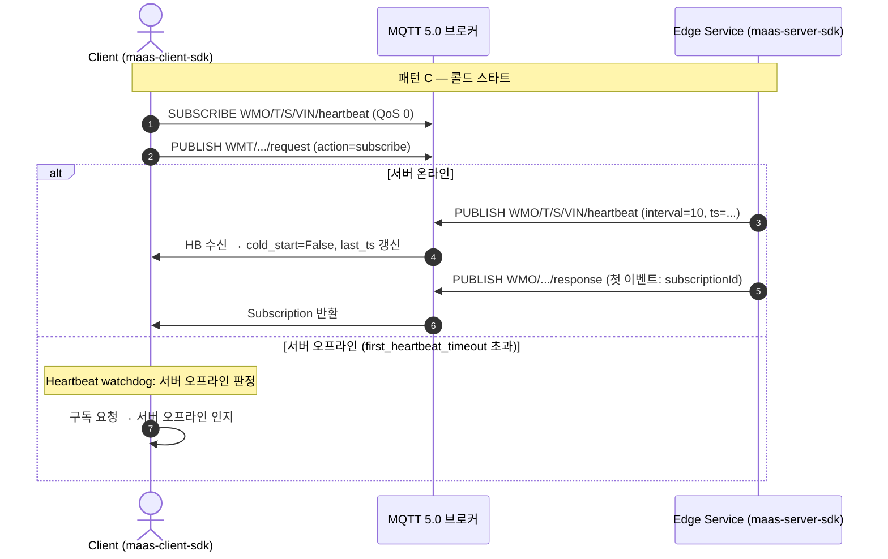
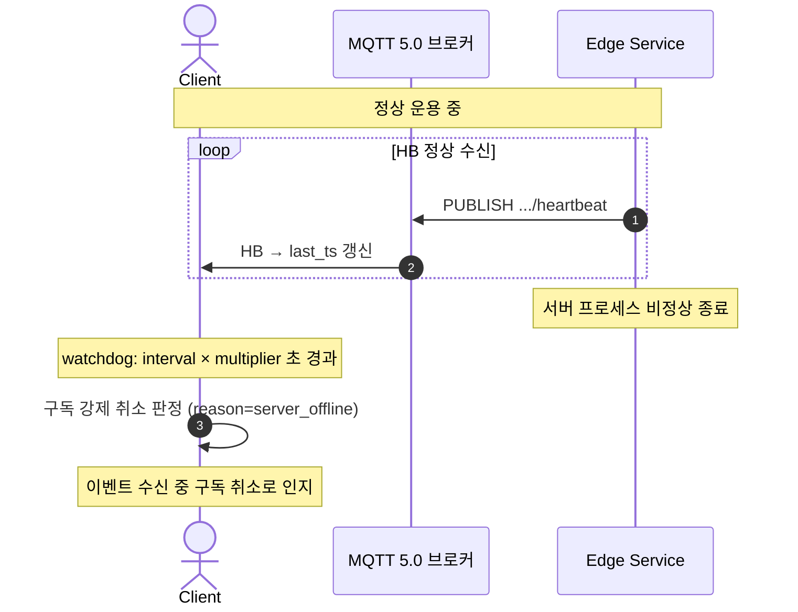
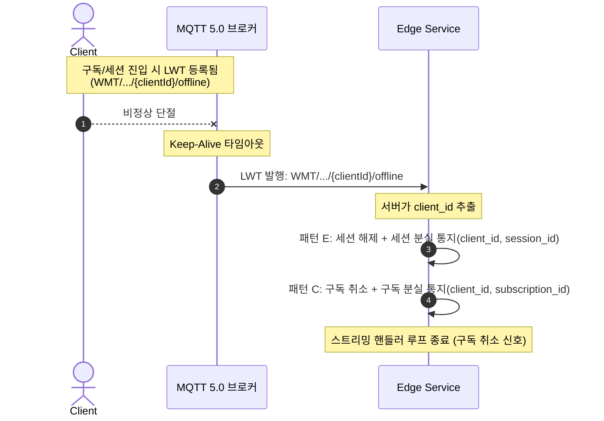

# MaaS RPC SDK — 연결 관리 정책

> 문서 유형: 정책서  
> 독자: SDK 개발자, 서비스 개발자, QA 엔지니어

---

## 1 개요

이 문서는 MaaS RPC SDK의 종단 간 연결 관리 정책을 기술한다. 연결 감시는 **대칭 구조**다:
- **서버 → 클라이언트 생존**: 서버가 **Heartbeat**를 주기 발행, 클라이언트가 watchdog로 단절 감지
- **클라이언트 → 서버 생존**: 클라이언트가 **LWT**를 등록, 단절 시 브로커가 발행하여 서버가 감지

두 메커니즘 모두 MQTT 표준 기능이라 브로커 비종속이며, CCU(pure MQTT)와 CGU(Greengrass) 환경에서 동일하게 작동한다.

> **역할 분리 원칙:** 연결의 *의미*(세션 시작/종료, 구독 시작/종료)는 응용계층이 action으로 정의한다. SDK는 *연결 감시*(살아있는가)만 담당하며, 단절을 감지하면 응용계층 콜백을 호출한다.

---

## 2 연결 관리 전략

연결 단절은 두 방향으로 발생한다.

| 단절 방향 | 감지 메커니즘 | 처리 결과 |
|----------|-------------|---------|
| 서버 오프라인 (서버 → 클라이언트) | Heartbeat watchdog | 클라이언트에서 구독 취소(server_offline) / 서버 오프라인 인지 |
| 클라이언트 단절 (클라이언트 → 서버) | **LWT** (`WMT/.../{ClientId}/offline`) | 서버가 패턴 C 구독 취소 / 패턴 E 세션 해제 + 응용 통지 |

---

## 3 패턴별 적용 전략

| 패턴 | 클라이언트 단절 감지 (서버 측) | 서버 단절 감지 (클라이언트 측) |
|------|---------------------|---------------|
| A — Best-Effort 조회 (QoS 0) | 해당 없음 | 타임아웃 |
| B — 신뢰성 제어 (QoS 1) | 해당 없음 | 타임아웃 (실행 여부 불명확) |
| C — 스트리밍 구독 | **LWT** → 구독 취소 + 구독 분실 통지 | Heartbeat watchdog |
| D — 시한성 제어 (QoS 1) | 해당 없음 | 유효기간 초과 (미실행 보장) |
| E — 독점 세션 | **LWT** → 세션 해제 + 세션 분실 통지 | Heartbeat watchdog |

> 구 패턴 F(유한 스트리밍)는 패턴 C로 통합되었다.

연결 감시(양방향 생존 확인)가 실질적으로 필요한 패턴은 **패턴 C(스트리밍 구독)** 와 **패턴 E(독점 세션)** 다. 두 패턴 모두 장시간 지속되므로 LWT(클라이언트 생존)와 Heartbeat(서버 생존)로 양방향 감시한다. 나머지 패턴(A/B/D)은 단발성이라 타임아웃 메커니즘이 경계를 형성한다.

---

## 4 오류 분류

### 에러 기원별 분류

| 기원 | 결과 분류 | 설명 |
|------|----------|------|
| **서버 명시 응답** | 서버 오류 | 서버가 `reason_code` User Property로 반환 |
| **서버 명시 응답** | 권한 없음 | `reason_code=0x87` |
| **서버 명시 응답** | 세션 점유 거부 | `reason_code=0x8A` |
| **클라이언트 판단** | 타임아웃 | 응답 없음 — 실행 여부 불명확 (패턴 B) |
| **클라이언트 판단** | 유효기간 초과 | `valid_for` 초과 — 미실행 보장 (패턴 D) |
| **서버 시그널** | 서버 주도 구독 취소 | 서버가 EOF + `cancel_reason` 전송 |
| **클라이언트 watchdog** | 서버 오프라인 | Heartbeat 미수신으로 클라이언트 판단 |

### 패턴 C 상세

| 상황 | 결과 분류 | 발생 시점 |
|------|----------|----------|
| 서버 정책 취소 | 서버 주도 구독 취소 (reason=`quota_exceeded`) | 이벤트 수신 중 |
| 서버 오프라인 — 운용 중 HB 타임아웃 | 서버 주도 구독 취소 (reason=`server_offline`) | 이벤트 수신 중 |
| 서버 오프라인 — 콜드 스타트 | 서버 오프라인 인지 | 구독 요청 시 |
| 클라이언트 주도 unsubscribe | 정상 종료 (오류 없음) | — |
| 클라이언트 단절 → 서버 취소 | 서버 측만 정리, EOF 정상 전송 | 서버 스트리밍 핸들러 |
| 서버 오프라인 — 단일 호출 | 타임아웃 | 단일 RPC 호출 시 |

---

## 5 메시지 QoS 및 만료 정책

### 5.1 QoS 미러링 — User Property `qos`

AWS IoT Core + Greengrass Nucleus 브리지 환경에서는 `msg.qos`가 원본 클라이언트 QoS를 신뢰성 있게 전달하지 않을 수 있다. Greengrass Nucleus가 IoT Core에서 로컬 브로커로 메시지를 재발행할 때 QoS를 정규화할 수 있기 때문이다.

이를 해결하기 위해 클라이언트 SDK는 모든 요청에 `User Property: qos=<값>`을 자동으로 삽입하고, 서버 SDK는 이 값을 읽어 응답 QoS를 결정한다.

| 규칙 | 내용 |
|------|------|
| 클라이언트 | 모든 요청 PUBLISH에 `User Property: qos=<0 또는 1>` 자동 삽입 |
| 서버 | `user_props.get("qos", "1")`로 읽어 응답 QoS 결정 |
| 미포함 시 | 기본값 `"1"` → 구버전 클라이언트 하위 호환 |

### 5.2 응답 Message Expiry

서버가 QoS 1로 응답할 때 Message Expiry를 설정하지 않으면 클라이언트가 이미 포기한 뒤에도 응답이 Nucleus/IoT Core에 무기한 보관된다. 이를 방지하기 위해 서버 SDK는 응답에 Message Expiry를 자동으로 설정한다.

```
응답 Message Expiry = max(1, ceil(T_timeout − T_processing))

T_timeout    = User Property: timeout 값 (클라이언트가 삽입)
T_processing = 요청 수신 시각부터 응답 발행 시각까지 경과 시간 (서버 측정)
```

이 공식은 클라이언트의 남은 대기 시간에 응답이 도달할 수 있도록 하되, 클라이언트가 이미 포기한 경우 브로커가 응답을 빠르게 폐기하도록 한다.

### 5.3 Clean Start 정책

| 대상 | 값 | 이유 |
|------|-----|------|
| 클라이언트 | `True` | 이전 세션의 stale 응답이 새 요청 대기 큐에 도달하는 것 차단 |
| 서버 | `True` | 재시작 후 브로커에 보관된 stale 요청 실행 방지. 특히 패턴 D에서 중요 |

> **패턴 D와 Clean Start:** 패턴 B처럼 `timeout`이 긴 경우 Message Expiry도 길어 브로커가 메시지를 보관할 수 있다. 서버가 재시작하면 이 stale 요청이 전달되어 클라이언트가 이미 포기한 명령이 실행될 수 있다. Clean Start = True가 이를 원천 차단한다.

### 5.4 패턴 D `sent_at` 검증

브로커 Message Expiry는 브로커까지의 전달만 보호한다. 서버 내부 큐 적체로 메시지가 제때 수신됐으나 처리가 지연되는 경우를 추가로 방어하기 위해 패턴 D는 요청에 발신 시각을 포함한다.

```
User Property: sent_at = Unix epoch milliseconds (클라이언트 삽입)
```

서버 SDK는 핸들러 호출 전 다음을 검증한다:

```
now_ms − sent_at_ms > (valid_for × 1000) + clock_tolerance_ms(500)
  → True: 핸들러 미호출, 경고 로그, 응답 없음
  → False: 정상 실행
```

클라이언트는 `valid_for` 초과 시 유효기간 초과로 포기하며, 서버 측 검증과 결합하여 **명령 미실행이 보장**된다.

> **전제:** 클라이언트와 서버 시계가 NTP로 동기화되어 있어야 한다. 허용 오차 500ms 이내를 권장한다.

---

## 6 Heartbeat 프로토콜

### 6.1 채택 배경

MaaS RPC 서버는 Greengrass Nucleus 경유로 AWS IoT Core에 연결한다. 이 구조에서 서버 프로세스는 자신의 MQTT 연결 상태를 직접 알 수 없으며, MQTT LWT(Last Will and Testament)를 서버가 직접 제어할 수도 없다.

Heartbeat는 이 제약을 우회한다. 서버는 연결 상태를 알 필요 없이 프로세스가 살아있는 동안 주기적으로 신호를 발행한다. 프로세스가 종료되면 신호가 자연히 멈추고, 클라이언트는 타임아웃으로 이를 감지한다.

### 6.2 토픽 · 페이로드 스펙

```
토픽:    WMO/{ThingType}/{Service}/{VIN}/heartbeat
QoS:     0  (fire-and-forget, 재전송 없음)
Retain:  false
Message Expiry Interval: heartbeat_interval 초 (MQTT 5.0)
페이로드: {"interval": <float>, "ts": <unix epoch float>}
발행 주기: heartbeat_interval 초 (기본 10초)
```

- `interval`: 서버가 사용하는 발행 간격(초). 클라이언트가 타임아웃을 동적으로 조정하는 데 활용한다.
- `ts`: 발행 시각(Unix epoch). 클라이언트가 stale 메시지를 필터링하는 데 사용한다.
- 기존 응답 와일드카드 `WMO/+/+/+/{ClientId}/response`(6세그먼트)와 구조가 다름(5세그먼트) → 클라이언트가 별도로 구독한다.

### 6.3 오래된 메시지 방어 (삼중)

Greengrass 내부 버퍼 등에서 stale HB가 뒤늦게 도달하더라도 오탐이 발생하지 않도록 세 계층에서 방어한다.

| 계층 | 메커니즘 | 효과 |
|------|----------|------|
| 1 — MQTT QoS 0 | 브로커 큐잉 없음 | 구독자 오프라인 시 메시지 즉시 소멸 |
| 2 — Message Expiry | 브로커가 `interval`초 후 폐기 | Greengrass 내부 버퍼에서도 만료 |
| 3 — Timestamp 필터 | `now - msg.ts > interval × 2` 이면 클라이언트가 무시 | 최후 방어선 |

### 6.4 타임아웃 파라미터

| 파라미터 | 기본값 | 위치 | 설명 |
|----------|--------|------|------|
| `heartbeat_interval` | 10.0s | 서버 측 설정 | HB 발행 간격. `0` 이하면 비활성화 |
| `heartbeat_hint_interval` | 10.0s | 클라이언트 측 설정 | 첫 HB 수신 전 타임아웃 계산에 사용하는 힌트 값 |
| `heartbeat_timeout_multiplier` | 3.0 | 클라이언트 측 설정 | `timeout = interval × multiplier` |
| `first_heartbeat_timeout` | 30.0s | 클라이언트 측 설정 | 콜드 스타트 시 첫 HB 최대 대기 시간 |

**간헐적 연결 내성**: `interval=10s`, `multiplier=3` → 타임아웃 30초. 차량 이동 중 짧은 단절(5~15초)에 오경보가 발생하지 않는다.

**타임아웃 계산 요약:**
```
운용 중 타임아웃   = (known_interval 또는 hint_interval) × timeout_multiplier
콜드 스타트 타임아웃 = first_heartbeat_timeout
```

---

## 7 클라이언트 단절 → 서버 자동 정리 (LWT)

### 7.1 LWT 메커니즘

클라이언트 SDK는 패턴 C 구독 또는 패턴 E 세션에 진입할 때 LWT(Last Will and Testament)를 등록한다.

```
토픽:    WMT/{ThingType}/{Service}/{VIN}/{ClientId}/offline
QoS:     1
페이로드: {"clientId": <client_id>}
```

> LWT 페이로드는 CONNECT 시점에 고정 등록되므로 단절 시각을 담을 수 없다. 서버는 토픽의 `{ClientId}` 또는 페이로드의 `clientId`로 단절 주체만 식별한다.

클라이언트가 **비정상 단절**되면(정상 disconnect가 아닌 경우) 브로커가 Keep-Alive 타임아웃 후 이 will 메시지를 대신 발행한다.

```
클라이언트 비정상 단절
  → 브로커가 LWT 발행: WMT/.../{clientId}/offline
  → 서버 수신 (WMT/.../+/offline 구독)
  → client_id 추출 후 정리:
      ├─ 패턴 E 세션 보유 시: 세션 해제 + 세션 분실 통지(client_id, session_id)
      └─ 패턴 C 구독 보유 시: 구독 취소 + 구독 분실 통지(client_id, subscription_id)
```

### 7.2 LWT vs IoT Core lifecycle 이벤트

| 항목 | LWT (채택) | IoT Core lifecycle (미채택) |
|------|-----------|---------------------------|
| 표준 | MQTT 5.0 표준 | AWS 독점 |
| 브로커 종속 | 없음 (CCU pure MQTT 포함) | IoT Core 전용 |
| 정상 종료 감지 | 안 함 (will 미발행) | 함 |
| 비정상 종료 감지 | 함 | 함 |

> **정상 종료는 LWT로 감지하지 않는다.** 클라이언트가 명시적으로 종료 action(예: `disconnect`)을 호출하면 서버 응용이 세션을 해제하고, 정상 disconnect 시 브로커는 will을 발행하지 않는다. 즉 **정상 종료 = 응용계층 action**, **비정상 종료 = LWT**로 역할이 나뉜다.

### 7.3 서버 구독 설정

서버는 독점 서비스이거나 스트리밍 핸들러를 제공하면(패턴 C/E) LWT 토픽을 자동 구독한다.

```
WMT/{ThingType}/{Service}/{VIN}/+/offline   (QoS 1)
```

---

## 8 시퀀스 다이어그램

### 8.1 콜드 스타트 — 서버 온라인 / 서버 오프라인



### 8.2 운용 중 서버 단절 (HB 타임아웃)



### 8.3 클라이언트 단절 → 서버 취소 (LWT)



---

## 9 연결 감시 동작 요약 (정책)

본 절은 연결 감시의 *정책*을 요약한다. 구체 API와 사용 예는
[SDK 요구사양서](spec/SDK%20%EC%9A%94%EA%B5%AC%EC%82%AC%EC%96%91%EC%84%9C.md)·[SDK 상세설계사양서](spec/SDK%20%EC%83%81%EC%84%B8%EC%84%A4%EA%B3%84%EC%82%AC%EC%96%91%EC%84%9C.md)를 단일 출처로 한다.

### 9.1 서버 측 정책

- 서버는 `heartbeat_interval`(기본 10초) 주기로 Heartbeat를 발행한다. `0` 이하면 비활성화된다.
- 패턴 C(스트리밍) 또는 패턴 E(독점 세션)를 제공하면 서버는 LWT 토픽(`WMT/.../+/offline`)을 자동 구독하여 클라이언트 비정상 단절을 감지한다. 별도 설정은 불필요하다.

### 9.2 클라이언트 측 정책

- 클라이언트는 Heartbeat 타임아웃을 `(known_interval 또는 hint_interval) × timeout_multiplier`로 계산하며(§6.4), 콜드 스타트에는 `first_heartbeat_timeout`을 적용한다.
- 패턴 C: 서버가 첫 이벤트를 `is_EOF=false`로 응답하면 구독 모드로 전환하고 Heartbeat를 자동 감시한다.
  운용 중 HB 타임아웃은 구독 취소(reason=`server_offline`), 콜드 스타트 타임아웃은 서버 오프라인으로 인지한다(§4 패턴 C 상세).
- 패턴 E: 서버가 `session_id`를 부여하면 클라이언트는 LWT를 등록하고 서버 Heartbeat를 자동 감시한다. 정상 종료(`session_id=""`) 시 감시를 중단한다.
- 패턴 C/E와 무관하게, 클라이언트는 특정 서버의 생존을 독립적으로 감시할 수도 있다(서버 감시 watcher).

---

## 10 후속 과제

현재 구현은 Heartbeat 단독으로 서버 생존을 감시한다. 아래 세 가지 대안 기술은 검토 결과 현재 범위에 포함하지 않았으나, 향후 도입을 위해 배경과 과제를 기록해 둔다.

### 10.1 Named Shadow 연동

**기대 효과:**
- 서버 시작 시 Named Shadow에 `{"status": "online", "ts": ..., "interval": N}` 기록
- 클라이언트가 구독 전 Shadow GET으로 현재 상태 즉시 확인 → 콜드 스타트 30초 대기 제거
- 서버 정상 종료 시 `{"status": "offline"}` 기록 → 즉각 감지

**한계:**
- 프로세스 크래시 시 Shadow는 자동 만료되지 않으므로 Heartbeat 병행 필요

**보류 이유:**
- Shadow 토픽 ACL 및 IPC 인가 정책을 Cloud 팀과 사양 협의 필요
- **하위 사물(client device)에서 서버를 구동하는 경우** — 코어 디바이스 Thing이 아닌 클라이언트 디바이스 Thing의 Shadow를 사용하는 시나리오를 포함하여 면밀한 검토 필요
- Named Shadow 네이밍 규칙, 접근 권한 범위 등 클라우드 아키텍처 결정 선행 필요

**후속 작업:**
- Cloud 팀과 Shadow 스키마 및 ACL 사양 협의
- 하위 사물 시나리오를 포함한 권한 모델 검토
- 확정 후 Heartbeat + Shadow 조합으로 패턴 C 구독 콜드 스타트 개선

### 10.2 클라우드 관리 플랫폼 REST API 경유

**기대 효과:**
- AWS IoT Core 관리 콘솔에 연결된 클라우드 관리 플랫폼이 다음을 조회하여 클라이언트에게 RESTful API로 제공
  - 코어 디바이스의 MQTT 연결 상태 (IoT Core Connectivity)
  - Greengrass 컴포넌트 활성 상태 (RUNNING / ERRORED 등)
- 클라이언트는 MQTT 구독 없이 HTTP GET으로 서비스 가용 여부 사전 확인 가능

**보류 이유:**
- 클라우드 관리 플랫폼 구현 및 API 설계가 이 SDK 범위 밖
- AWS IoT Greengrass Fleet Status API 활용 방식 및 IAM 권한 설계 필요
- 실시간성 제약: Greengrass 컴포넌트 상태 보고 주기에 따라 지연 발생 가능

**후속 작업:**
- 클라우드 관리 플랫폼 팀과 API 스펙 협의
- 클라이언트가 연결 전 REST로 서버 상태를 사전 확인하는 옵션 추가 검토
- 역할 분리: REST API = 초기 가용성 확인, Heartbeat = 운용 중 생존 감시

### 10.3 서버 단절 감지용 LWT (미채택, 후속 과제)

> **주의 — 방향 구분:** §7의 LWT는 **클라이언트 단절을 서버가 감지**하는 용도로 **채택**됐다. 본 절은 그 반대 방향, 즉 **서버 단절을 클라이언트가 감지**하는 데 LWT를 쓰는 방안으로, 이는 **미채택**(Heartbeat 사용)이다.

**기대 효과:**
- pure MQTT 환경에서 서버가 MQTT LWT를 설정하면 브로커가 서버 단절을 자동 감지·발행

**미채택 이유:**
- Greengrass IPC 환경에서는 서버가 LWT를 등록할 수 없음 (IPC 미지원)
- LWT는 연결 단절은 감지하지만 **프로세스 크래시(디바이스 연결 유지 상태)** 는 감지하지 못하므로 서버 생존 감시에는 Heartbeat가 필수
- → 서버 생존 감시는 Heartbeat로 단일화 (§6)
