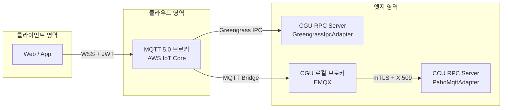

# MaaS RPC 개념설계서

> 문서 유형: 개념설계서
> 독자: 모든 개발자 (신규 합류 포함)

---

## 1. 빠른 이해 (Quick Overview)

이 섹션은 MaaS RPC SDK를 처음 접하는 개발자를 위한 최소 진입점이다.

### 시스템이 하는 일

웹/앱 클라이언트가 MQTT 5.0 브로커를 통해 엣지(차량, 장비 등)의 서비스를 **원격 함수 호출(RPC)** 방식으로 제어·조회한다.

```
[Web/App]  --WSS+JWT-->  [MQTT 5.0 브로커]  --TLS+X.509-->  [Edge Service]
 maas-client-sdk                                              maas-server-sdk
```

### 클라이언트 측 5줄 요약

```python
from maas_client import MaasClient

client = MaasClient(
    endpoint="mqtt.example.com",
    client_id="my-client",
    thing_type="CGU", service="viss", vin="VIN-001",
)
client.connect()
result = client.call("get", {"path": "Vehicle.Speed"})   # RPC 호출
client.disconnect()
```

### 서버 측 5줄 요약

```python
from maas_server import MaasServer, RpcContext

server = MaasServer(thing_type="CGU", service_name="viss", vin="VIN-001",
                    endpoint="mqtt.example.com")

@server.action("get")
def get_datapoint(ctx: RpcContext):
    return {"value": 42.0}

server.run()   # 블로킹
```

### 토픽 패턴 한눈에 보기

| 방향 | 토픽 패턴 |
|------|-----------|
| 클라이언트 → 서비스 | `WMT/{ThingType}/{Service}/{VIN}/{ClientId}/request` |
| 서비스 → 클라이언트 | `WMO/{ThingType}/{Service}/{VIN}/{ClientId}/response` |

클라이언트 구독: `WMO/+/+/+/{ClientId}/response` (단 1개, 연결 시 자동 등록)

---

## 2. 문서 목적 및 범위

본 문서는 MaaS RPC 프레임워크의 **개념·원칙·설계 배경**을 정의한다.

- 대상 독자: 신규 개발자, 아키텍트, 연동 담당자
- 포함 내용: 설계 배경, 핵심 원칙, 개념 아키텍처, 메커니즘 개요, RPC 패턴 요약
- 제외 내용: API 상세 명세(→ SDK README), 구현 내부 구조(→ SDK 상세설계사양서)

---

## 3. 설계 배경 — 왜 MQTT 5.0 네이티브 RPC인가

### 3.1 문제: 엣지 서비스에 대한 안정적 RPC

엣지 장비는 TCP 포트를 직접 노출하기 어렵다. 방화벽, NAT, 불안정한 모바일 네트워크가 직접 연결을 막는다. 그래서 MQTT 브로커를 중간에 두는 방식이 일반적이다.

그러나 브로커를 쓰면 새 문제가 생긴다.

- 요청에 대한 응답을 어떻게 구분하는가?
- 여러 클라이언트가 동시에 요청할 때 응답이 섞이지 않는가?
- 스트리밍 데이터를 어떻게 처리하는가?
- 단 하나의 클라이언트만 명령 가능한 세션은 어떻게 구현하는가?

### 3.2 해결: HTTP Envelope 없이 MQTT 5.0 Properties만 사용

MQTT 5.0은 메시지에 추가 메타데이터를 붙이는 **Properties** 기능을 제공한다. MaaS RPC SDK는 이 Properties만으로 RPC의 모든 메커니즘을 처리한다.

별도의 HTTP Envelope 게이트웨이, 커스텀 프레이밍 프로토콜, 중앙 조정 서버가 필요 없다.

---

## 4. 핵심 설계 원칙

| 원칙 | 내용 |
|------|------|
| **Envelope 없음** | MQTT 5.0 Properties(`Response Topic`, `Correlation Data`, `User Property`)로만 RPC 메타데이터 처리 |
| **토픽 은닉** | 애플리케이션 코드는 WMT/WMO 전체 경로를 몰라도 된다. SDK가 자동 생성 |
| **단일 구독** | 클라이언트는 `WMO/+/+/+/{ClientId}/response` 단 1개만 구독. 모든 응답(단일·스트리밍)을 이 토픽으로 수신 |
| **Clean Start = True** | 재연결 시 stale 응답이 클라이언트에 도달하는 것을 방지 |
| **동기 우선** | `MaasClient`(동기 Facade)가 기본. asyncio 환경은 `MaasClientAsync` |
| **어댑터 추상화** | 서버 SDK는 `MqttClientAdapter` Protocol로 paho-mqtt(CCU)와 Greengrass IPC(CGU)를 교체 가능하게 지원 |

---

## 5. 시스템 개념 아키텍처



### 두 가지 엣지 서버 시나리오

| 항목 | CGU (Greengrass Component) | CCU (Client Device) |
|------|---------------------------|---------------------|
| 연결 방식 | Greengrass IPC (Unix Socket) | paho-mqtt → EMQX (mTLS) |
| SDK 어댑터 | `GreengrassIpcAdapter` | `PahoMqttAdapter` |
| `@server.action` 코드 | **동일** | **동일** |
| `server.run()` | **동일** | **동일** |

---

## 6. 핵심 메커니즘 개요

### 6.1 WMT/WMO 토픽 체계

| 방향 | 접두어 | 의미 |
|------|--------|------|
| 클라이언트 → 서비스 | `WMT` | Web Mobile Terminated (요청) |
| 서비스 → 클라이언트 | `WMO` | Web Mobile Oriented (응답) |

토픽 구조:

```
요청:  WMT/{ThingType}/{Service}/{VIN}/{ClientId}/request
응답:  WMO/{ThingType}/{Service}/{VIN}/{ClientId}/response
```

- `{ThingType}`: 장비 타입 (예: CGU, SDM)
- `{Service}`: 서비스 이름 (예: viss, diagnostics)
- `{VIN}`: 대상 장비 식별자
- `{ClientId}`: 응답 라우팅용 클라이언트 식별자 (UUID 권장)

### 6.2 Correlation Data 기반 요청-응답 매핑

여러 RPC 요청이 동시에 진행 중일 때 응답이 섞이지 않도록 매핑한다.

1. 요청 시 SDK가 UUID v4를 생성해 MQTT PUBLISH의 `Correlation Data` Property로 첨부
2. 서버는 응답 PUBLISH에 동일한 UUID를 그대로 포함
3. 클라이언트 SDK가 UUID로 `_pending` 맵(dict[bytes, asyncio.Future])에서 대기 중인 Future를 찾아 resolve

개발자가 직접 UUID를 관리할 필요가 없다.

### 6.3 Response Topic 기반 라우팅

클라이언트가 요청 PUBLISH의 `Response Topic` Property에 응답 받을 토픽을 명시한다.

- 서버는 MQTT 5.0 Property에서 `Response Topic`을 읽어 응답을 발행한다.
- 페이로드 안에 응답 주소를 넣지 않으므로 페이로드 구조가 단순하다.
- SDK가 자동으로 삽입하고 처리한다.

---

## 7. RPC 패턴 분류 (A~E) 요약표

| 패턴 | 이름 | QoS | 핵심 특징 |
|------|------|-----|-----------|
| A | Liveness | 0 | 빠른 상태 조회. Message Expiry 생략 |
| B | Reliable | 1 | 하드웨어 제어 등 결과 보장 필요 명령 |
| C | Streaming | 1 | 서버가 response 토픽으로 청크를 N번 발행. `is_EOF=true`로 종료 |
| D | Time-bound | 1 | SDK가 `timeout` 값을 `Message Expiry Interval`에 자동 동기화 |
| E | Exclusive | 1 | VIN별 Lock. 다른 클라이언트 요청 시 `0x8A(Server Busy)` 반환. 단절 시 자동 해제 |

자세한 내용은 [RPC_DESIGN.md](RPC_DESIGN.md) 참고.

---

## 8. SDK 구성 및 역할

### 8.1 maas-client-sdk

RPC를 **호출하는** 쪽. 웹 앱, 관리 도구, 테스트 스크립트 등에서 사용한다.

| 클래스 | 환경 |
|--------|------|
| `MaasClient` | 일반 Python 스크립트, Flask 등 비async 환경. 내부적으로 asyncio 루프를 전용 스레드에서 운영하는 동기 Facade |
| `MaasClientAsync` | asyncio 환경에서 직접 사용 |

**이중 호출 규칙:**
- 생성자 바인딩 시: `call(action[, params])`
- 플릿 등 VIN이 호출마다 바뀌는 경우: `call(thing_type, service, action, vin[, params])`

### 8.2 maas-server-sdk

RPC를 **처리하는** 쪽. 엣지 서비스에서 사용한다.

`mode` 파라미터로 전송 계층을 선택한다.

| mode | 설명 |
|------|------|
| `"mqtt"` (기본) | `PahoMqttAdapter`. `endpoint`, `vin` 필수 |
| `"greengrass"` | `GreengrassIpcAdapter`. `endpoint` 불필요. `vin`은 connect 후 `AWS_IOT_THING_NAME` 환경변수로 자동 취득 |

---

## 9. 관련 문서

| 문서 | 내용 |
|------|------|
| [RPC_DESIGN.md](RPC_DESIGN.md) | 기능정의서: 패턴별 시퀀스 다이어그램, 전제·사후조건, 내부 메커니즘 |
| [TOPIC_AND_ACL_SPEC.md](TOPIC_AND_ACL_SPEC.md) | 인터페이스 정의서: 토픽 구조, ACL, Reason Code, 인증·인가 정책 |
| [spec/SDK 요구사양서.md](spec/SDK%20%EC%9A%94%EA%B5%AC%EC%82%AC%EC%96%91%EC%84%9C.md) | SDK 기능·비기능 요구사항 |
| [spec/SDK 상세설계사양서.md](spec/SDK%20%EC%83%81%EC%84%B8%EC%84%A4%EA%B3%84%EC%82%AC%EC%96%91%EC%84%9C.md) | SDK 구현 아키텍처, 자료구조, 어댑터 패턴 |
| [references/sdm/04. MaaS RPC 프레임워크 시스템요구사양서.md](references/sdm/04.%20MaaS%20RPC%20%ED%94%84%EB%A0%88%EC%9E%84%EC%9B%8C%ED%81%AC%20%EC%8B%9C%EC%8A%A4%ED%85%9C%EC%9A%94%EA%B5%AC%EC%82%AC%EC%96%91%EC%84%9C.md) | 상위 계층 시스템 요구사양 (참고 전용) |
| [sdk/python/client/README.md](../sdk/python/client/README.md) | 클라이언트 SDK 설치·API |
| [sdk/python/server/README.md](../sdk/python/server/README.md) | 서버 SDK 설치·API |
| [examples/python/README.md](../examples/python/README.md) | 실행 가능한 예제 |
