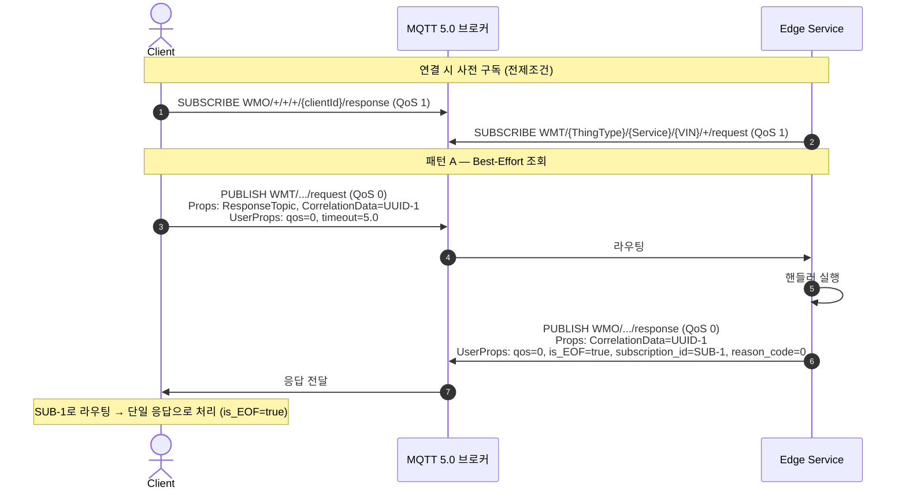
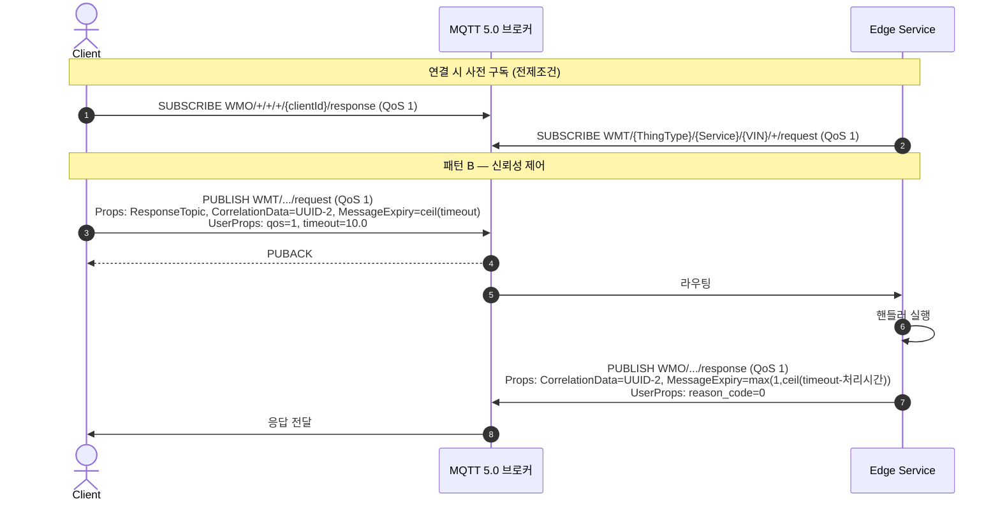
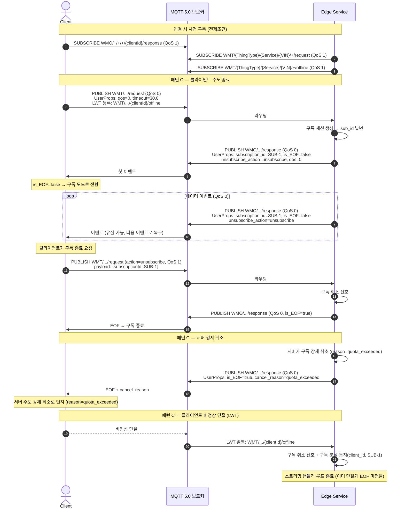
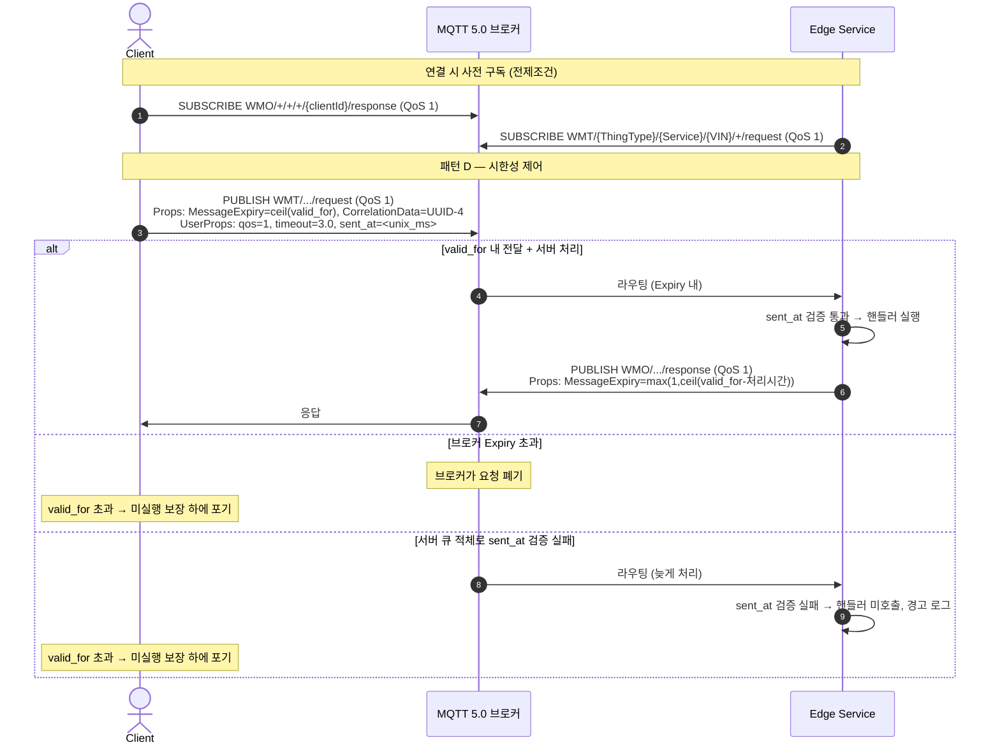
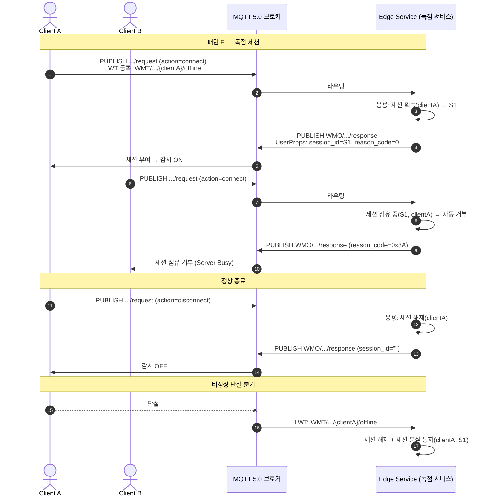

# MaaS RPC 기능정의서

> 문서 유형: 기능정의서 (개념설계)
> 독자: SDK 개발자, 서비스 개발자, QA 엔지니어
>
> 본 문서는 RPC 패턴의 **개념**을 정의한다. 프로토콜 동작·토픽·패턴·연결 정책만 다루며,
> 특정 SDK의 클래스·메서드·코드는 기술하지 않는다. SDK 공개 API는 [SDK 요구사양서](spec/SDK%20%EC%9A%94%EA%B5%AC%EC%82%AC%EC%96%91%EC%84%9C.md),
> 내부 구현은 [SDK 상세설계사양서](spec/SDK%20%EC%83%81%EC%84%B8%EC%84%A4%EA%B3%84%EC%82%AC%EC%96%91%EC%84%9C.md)를 단일 출처로 한다.

---

## 1. 개요

MaaS RPC는 MQTT 5.0 브로커를 통해 클라이언트와 엣지 서비스 사이의 요청-응답 통신을 구현한다. 별도의 Envelope 프로토콜 없이 MQTT 5.0 표준 Properties만으로 요청-응답 상관관계, 스트리밍, 독점 세션을 처리한다.

### 1.1 기본 원칙

- **Envelope 없음:** MQTT 5.0의 `Response Topic`, `Correlation Data`, `User Property`로 모든 RPC 메타데이터를 처리
- **action 필드 라우팅:** 페이로드에 `action` 필드를 포함하여 핸들러를 라우팅한다. 클라이언트가 이 필드를 채워 발행한다
- **단일 응답 토픽:** 단일 응답과 스트리밍 이벤트 모두 response 토픽 하나로 전달
- **동기 우선:** 기본 사용 모델은 동기 블로킹 요청-응답이다

### 1.2 토픽 구조

```
요청:  WMT/{ThingType}/{Service}/{VIN}/{ClientId}/request
응답:  WMO/{ThingType}/{Service}/{VIN}/{ClientId}/response
```

스트리밍 이벤트도 단일 응답과 동일한 response 토픽으로 전달된다. `User Property: is_EOF`로 이벤트(`false`)와 완료 신호(`true`)를 구분한다.

---

## 2. 기능 목록

| 기능 ID | 패턴 이름 | QoS | 설명 |
|---------|-----------|-----|------|
| RPC-A | Best-Effort 조회 | 0 | 빠른 상태 조회. Expiry 생략 |
| RPC-B | 신뢰성 제어 | 1 | 결과 보장 명령. 재전송 보장 |
| RPC-C | 스트리밍 구독 | 0 (서버가 1 선택 가능) | 패턴 A와 동일한 요청 형태. 서버가 `is_EOF=false`로 스트림 선언. 유한/무한 모두 지원(generator 자연 종료=유한, 무한 루프=무한). 클라이언트 주도 종료·콜백·서버 강제 취소. 순서 중요 시 서버가 `qos=1` 선택 |
| RPC-D | 시한성 제어 | 1 | 유효기간(valid_for=N) 초과 시 미실행 보장 |
| RPC-E | 독점 세션 | 1 | 서비스 단위 독점. `session_id` 신호. 응용계층이 세션 시작/종료, 프로토콜 계층이 접근 제어·연결 감시. 단절 시 LWT로 자동 해제 |

> **패턴 F(유한 스트리밍) 통합:** 구 패턴 F는 패턴 C로 통합되었다. 서버 generator가 유한하게 끝나면 자연 종료(구 F), 무한 루프면 클라이언트/서버 취소로 종료(기존 C)된다. MQTT 대용량 파일 전송은 지원 범위가 아니다.

### 2.1 패턴과 QoS·만료의 관계

각 패턴은 사용하는 QoS와 Message Expiry 정책으로 구분된다. 단일 응답 패턴(A/B/D)은 클라이언트가 요청에 사용한 QoS를 `User Property: qos`로 선언하고 서버가 이를 미러링하여 응답한다. 스트리밍(C)은 서버가 응답 스트림의 QoS를 독립적으로 결정한다. 독점 세션(E)처럼 의미가 특정 QoS에 묶이지 않는 경우 호출자가 QoS·옵션을 직접 지정한다.

모든 응답은 동일한 response 토픽으로 전달되며, 서버가 `is_EOF`/`session_id` User Property로 응답 종류(단일/스트림/세션)를 선언하면 클라이언트가 이를 자동 판별한다.

---

## 3. 패턴 A: Best-Effort 조회

### 3.1 기능 설명

응답을 받지 못해도 재시도할 수 있는 상태 조회에 사용한다.
QoS 0으로 발행하므로 브로커가 메시지를 큐에 저장하지 않아 빠르다.
네트워크 상태에 따라 요청 또는 응답이 유실될 수 있다.

**패턴 C(스트리밍 구독)와의 관계:** 패턴 A와 패턴 C는 모두 QoS 0을 사용하며, 클라이언트의 요청 형태가 동일하다. 서버가 `is_EOF` User Property로 단일 응답 여부를 선언하며, 클라이언트가 자동으로 판별한다. 패턴 C 상세는 Section 5 참조.

**사용 시나리오:**
- 현재 센서 값 읽기 (속도, 연료, 온도)
- 서비스 생존 여부 확인
- 주기적으로 폴링하는 상태 조회

| 항목 | 값 |
|------|----|
| QoS | 0 |
| Message Expiry | 생략 |
| 클라이언트 timeout 기본값 | 5.0초 |
| 서비스 응답 QoS | 0 (요청의 `User Property: qos` 미러링) |
| 서비스 응답 `is_EOF` | `"true"` — 서버가 단일 응답 선언 |
| 서비스 응답 `subscription_id` | UUID — 서버가 발번하여 삽입 |

요청은 페이로드에 조회 대상 `action`을 담아 QoS 0으로 발행된다. 서버는 요청의 `qos` User Property를 미러링해 QoS 0으로 응답하고, 단일 응답임을 알리기 위해 `is_EOF="true"`와 라우팅용 `subscription_id`(UUID)를 응답에 첨부한다. 클라이언트는 `is_EOF="true"`를 보고 이를 단일 응답으로 처리한다.

### 3.2 전제조건 / 사후조건

**전제조건:**
- 클라이언트는 `WMO/+/+/+/{ClientId}/response`를 구독 중이어야 한다
- 서비스는 `WMT/{ThingType}/{Service}/{VIN}/+/request`를 구독 중이어야 한다

**사후조건:**
- 성공: 응답 페이로드에 조회 결과, `reason_code=0`
- 실패(타임아웃): 응답 없음 — 네트워크 불안정 또는 서비스 부재가 원인. **재시도 가능**
- 서비스 오류: `reason_code` 값으로 원인 구분

**서비스 측 응답 규칙:**
- `User Property: qos` 값을 읽어 동일한 QoS로 응답 (QoS 미러링)
- `User Property: is_EOF="true"` 삽입 — 단일 응답 선언
- `User Property: subscription_id=<uuid>` 발번 — 클라이언트 라우팅 통일
- `User Property: qos` 미포함 시 기본값 QoS 1 (구버전 클라이언트 하위 호환)

### 3.3 시퀀스 다이어그램



---

## 4. 패턴 B: 신뢰성 제어

### 4.1 기능 설명

결과 확인이 필요한 하드웨어 제어 명령에 사용한다.
QoS 1로 발행하므로 브로커가 서비스에 정확히 한 번 전달함을 보장한다.
응답을 받지 못한 경우(timeout) 명령 실행 여부가 불명확하므로 재시도 시 중복 실행 가능성을 고려해야 한다.

**사용 시나리오:**
- 작업등 켜기/끄기
- 도어락 작동
- 릴레이·액추에이터 제어

| 항목 | 값 |
|------|----|
| QoS | 1 |
| 요청 Message Expiry | `ceil(timeout)` 자동 설정 — stale 요청 브로커 폐기 |
| 응답 Message Expiry | `max(1, ceil(timeout − 처리시간))` |
| 클라이언트 timeout 기본값 | 10.0초 |
| 서비스 응답 QoS | 1 (요청의 `User Property: qos` 미러링) |
| 서비스 응답 | `reason_code=0` (성공) 또는 `0x80/0x83` (실패) |

요청은 QoS 1로 발행되며 `qos="1"`, `timeout` User Property와 함께 요청 Message Expiry가 `ceil(timeout)`으로 설정된다. 서버는 `qos`/`timeout`을 읽어 QoS 1, 응답 Message Expiry `max(1, ceil(timeout − 처리시간))`으로 응답한다.

### 4.2 전제조건 / 사후조건

**전제조건:**
- 클라이언트와 서비스 모두 QoS 1 구독 상태
- 서비스가 해당 action 핸들러를 등록한 상태

**사후조건:**
- 성공: 응답 페이로드에 실행 결과
- 실패: `reason_code=0x80` — 하드웨어/서버 오류
- 실패: `reason_code=0x83` — 비즈니스 로직 오류 (장비가 현재 수행 불가)
- 타임아웃: 응답 없음 — **실행 여부 불명확**. 재시도 시 중복 실행 가능성 고려 필요

### 4.3 시퀀스 다이어그램



---

## 5. 패턴 C: 스트리밍 구독

### 5.1 기능 설명

서버가 여러 이벤트를 연속 발행하는 스트리밍 패턴. 유한·무한 스트림을 모두 포괄한다.
**패턴 A와 클라이언트 요청 형태가 동일하다.** 서버가 `is_EOF=false`로 스트림임을 선언하면 클라이언트가 자동으로 구독 모드로 전환한다.

**종료 시나리오 (셋 다 지원):**
- **서버 자연 종료** (유한 스트림): 서버 generator가 데이터를 모두 보내고 끝남 → `is_EOF=true`
- **클라이언트 종료**: 클라이언트가 구독 취소를 요청 → 서버에 `unsubscribe_action` 호출
- **서버 강제 취소**: 서버가 EOF에 `cancel_reason`을 첨부 → 클라이언트가 강제 취소로 인지

> 서버 generator를 유한하게 짜면(`for x in finite: yield x`) 데이터 소진 시 자연 종료되고, 무한 루프(`while True: yield`)면 취소로만 종료된다. 같은 메커니즘의 두 사용법이다.

**패턴 A vs 패턴 C 구분:**
| | 패턴 A | 패턴 C |
|--|--------|--------|
| 클라이언트 요청 | 단발 조회 | **동일한 요청 형태** |
| 서버 응답 `is_EOF` | `"true"` (즉시 완료) | `"false"` (스트림 지속) |
| 클라이언트 처리 | 단일 응답 | 구독(이벤트 반복 수신) |
| 서버 선언 | 단일 응답 | 스트림 핸들러로 선언 |

| 항목 | 값 |
|------|----|
| QoS | 0 기본. 서버가 순서 보장 필요 시 `qos=1` 선택 가능 |
| 종료 주체 | 서버 자연 종료 / 클라이언트 취소 / 서버 강제 취소 |
| `subscription_id` | 서버가 발번, **모든 이벤트**에 포함 |
| `unsubscribe_action` | 서버가 선언, **모든 이벤트**에 포함 |
| `is_EOF` | 이벤트: `"false"`, 마지막: `"true"` |
| 서버 강제 취소 | `cancel_reason` User Property로 사유 전달 |

**스트림 QoS — 서버가 결정:**
| | QoS 0 (기본) | QoS 1 |
|--|-------------|----------------|
| 순서/유실 | best-effort (유실 가능) | 순서·전달 보장 |
| EOF 유실 | 가능 → 클라이언트 timeout으로 종료 간주 | EOF 확실 전달 |
| 용도 | 센서 실시간 구독 | 순서 중요한 이벤트 로그 |
| 단절 시 | 즉시 소멸 | 브로커 큐잉 (비용) |

> 단일 응답(A/B/D)은 응답 QoS가 요청 `qos` User Property를 미러링하지만, 스트리밍(C)은 **서버가 응답 스트림 QoS를 독립 결정**한다. 순서가 중요한 스트림이면 클라이언트도 QoS 1로 구독 요청을 보내 구독 성립을 보장할 수 있다.

### 5.2 동작 흐름

스트리밍 구독은 다음과 같이 진행된다.

- **구독 성립:** 클라이언트가 패턴 A와 동일한 형태로 요청을 발행한다. 서버가 첫 이벤트를 `is_EOF=false`로 응답하면 클라이언트는 이를 구독으로 인식하고 이후 이벤트를 반복 수신한다.
- **이벤트 수신:** 서버는 데이터가 생길 때마다 동일 response 토픽으로 이벤트를 발행한다. 모든 이벤트에는 `subscription_id`와 `unsubscribe_action`이 포함되어, QoS 0에서 일부 이벤트가 유실되어도 클라이언트가 구독 식별·취소 정보를 잃지 않는다.
- **클라이언트 주도 종료:** 클라이언트가 구독을 멈추려 하면 `unsubscribe_action`이 지정한 action으로 취소 RPC를 보낸다. 서버는 핸들러 루프를 종료하고 `is_EOF=true`를 발행한다.
- **서버 강제 취소:** 서버가 정책상(예: 할당량 초과) 구독을 끊어야 하면 EOF에 `cancel_reason`을 첨부해 발행한다. 클라이언트는 이를 강제 취소로 인지한다.
- **서버 자연 종료:** 유한 스트림은 generator가 끝나면 서버가 `is_EOF=true`를 발행하여 정상 종료한다.

### 5.3 서버 측 동작 규칙

서버가 핸들러를 **스트림으로 선언**하면 프로토콜 계층은 다음을 자동 처리한다.

- 모든 이벤트에 `subscription_id`, `unsubscribe_action`, `is_EOF=false` 삽입
- yields 사이에서 취소 여부를 자동 점검 (서비스 코드에서 직접 점검 불필요)
- 기본 `unsubscribe` 취소 action 자동 등록 (응용계층이 커스텀 취소 로직을 등록하면 오버라이드)
- 종료 시 `is_EOF=true` 발행, 서버 강제 취소면 `cancel_reason` 첨부
- 클라이언트 LWT 단절 시 구독 자동 취소 + 응용계층에 구독 분실 통지

응용계층은 추가 정리가 필요할 때만 커스텀 취소 핸들러나 구독 분실 콜백을 정의하면 된다.

### 5.4 전제조건 / 사후조건

**전제조건:**
- 클라이언트는 연결 시 `WMO/+/+/+/{ClientId}/response`를 구독 중
- 서비스 핸들러가 스트림으로 등록된 상태

**사후조건:**
- 클라이언트 종료: 취소 RPC → 서버 핸들러 루프 종료 → EOF → 구독 종료
- 서버 강제 취소: EOF + `cancel_reason` → 클라이언트가 강제 취소로 인지
- 서비스 오류: `reason_code`로 전달

### 5.5 시퀀스 다이어그램



---

## 6. 패턴 D: 시한성 제어

### 6.1 기능 설명

유효기간 내에 실행되지 않으면 위험하거나 의미가 없는 명령에 사용한다.
`valid_for`로 명령의 유효 시간을 명시하며, 이 시간이 지나면 미실행이 **보장**된다.

패턴 B와의 차이:
- **패턴 B** (timeout=15): "15초 안에 응답을 주세요" — 타임아웃 시 실행 여부 불명확
- **패턴 D** (valid_for=3): "이 명령은 3초 동안만 유효합니다" — 타임아웃 시 미실행 보장

**보호 계층:**
1. 브로커: 요청 `Message Expiry = ceil(valid_for)` → 유효기간 초과 메시지 전달 차단
2. 서버: `sent_at` 검증 → 큐 적체로 인한 지연 실행 차단
3. 서비스 핸들러: 만료 여부 선택적 점검 → 다단계 처리 중 만료 감지

**사용 시나리오:**
- 원격 시동 (사용자가 요청했을 때만 유효)
- 시간 민감 제어 명령

| 항목 | 값 |
|------|----|
| QoS | 1 |
| 요청 Message Expiry | `ceil(valid_for)` 자동 설정 |
| 응답 Message Expiry | `max(1, ceil(valid_for − 처리시간))` |
| `valid_for` 기본값 | 10.0초 |
| clock_tolerance | 500ms (서버 측 만료 검증 허용 오차) |
| 서비스 응답 QoS | 1 (요청의 `User Property: qos` 미러링) |
| 유효기간 초과 시 | 클라이언트가 미실행 보장 하에 포기 |

요청은 QoS 1로 발행되며 `qos="1"`, `timeout`(=valid_for), `sent_at`(요청 발신 Unix ms) User Property와 요청 Message Expiry `ceil(valid_for)`를 함께 담는다. 서버는 핸들러 진입 전 `sent_at`을 검증하여 만료된 명령의 실행을 차단한다.

### 6.2 전제조건 / 사후조건

**전제조건:**
- 클라이언트와 서버 시계가 NTP로 동기화되어 있어야 한다 (허용 오차 500ms)
- 서비스가 해당 action 핸들러를 등록한 상태

**사후조건:**
- 성공: `valid_for` 내 실행 완료 + 응답 수신
- 유효기간 초과: **명령이 실행되지 않았음이 보장됨**. 재시도 안전
- 서비스 오류: 서버가 명시적으로 반환한 `reason_code`

**서버 측 만료 처리 규칙:**
- 핸들러 진입 전 `now - sent_at > valid_for + 500ms` 이면 핸들러를 호출하지 않고 경고 로그만 남긴다
- 응답을 보내지 않는다 — 클라이언트는 이미 유효기간 초과로 포기한 상태

### 6.3 시퀀스 다이어그램



---

## 7. 패턴 E: 독점 세션

### 7.1 기능 설명

UDS ECU 진단, OTA 펌웨어 업데이트 등 단 하나의 클라이언트만 서비스를 독점해야 하는 패턴.
**서비스 전체가 독점 단위**이며, 한 번에 하나의 활성 세션만 허용된다.

**핵심 원칙 — 역할 분리:**
- **응용계층(서버)**: 세션의 *의미*를 정의 (connect/disconnect 등 action 이름·내용 자유). 세션 획득·해제를 명시적으로 결정
- **프로토콜 계층**: 세션의 *메커니즘*만 담당 (session_id 발번, 접근 제어, 연결 감시, 단절 통지)
- **클라이언트**: 다른 패턴과 동일하게 평범한 요청. 자신이 세션을 부여받았다는 것만 알면 된다

**접근 제어:**
| 상황 | 처리 주체 | 동작 |
|------|----------|------|
| 세션 없음 + 요청 도착 | **서버 응용** | 핸들러 실행 → 세션 획득하거나 거부 |
| 세션 있음 + 다른 client_id 접근 | **프로토콜 계층** | 자동 거부 `0x8A` (Server Busy) |
| 세션 있음 + 세션 없는 요청(타 클라이언트) | **프로토콜 계층** | 자동 거부 `0x8A` |
| 세션 보유자의 모든 요청 | — | 통과 |

**세션 상태 신호 — `User Property: session_id`:**
| 값 | 의미 | 클라이언트 동작 |
|----|------|---------------|
| `<uuid>` | 세션 활성 | 감시 ON (최초 시 LWT 등록 + Heartbeat 감시) |
| `""` (빈 문자열) | 세션 종료 | 감시 OFF |
| 키 없음 | 비독점 서비스 (A/B/D) | 무관 |

> **재연결 주의:** Clean Start=True이므로 재연결 시 `client_id`와 `session_id`가 모두 새로 발번될 수 있다. 세션의 **진실 소스는 `session_id`** (client_id 아님). 재연결은 새 세션으로 취급되며, 이전 세션은 단절 통지로 정리된다.

### 7.2 세션 제어 흐름

- **세션 시작:** 응용계층이 정의한 시작 action(예: `connect`)이 도착하면 서버 응용이 세션을 획득한다. 프로토콜 계층은 응답에 `session_id=<uuid>`를 부착하고, 이를 받은 클라이언트는 LWT 등록과 서버 Heartbeat 감시를 시작한다.
- **세션 보유 중 호출:** 세션 보유자의 요청은 그대로 통과한다. 타 클라이언트의 요청은 프로토콜 계층이 `0x8A`(Server Busy)로 자동 거부한다.
- **정상 종료:** 응용계층이 정의한 종료 action(예: `disconnect`)이 도착하면 서버 응용이 세션을 해제하고, 프로토콜 계층은 응답에 `session_id=""`를 부착한다. 클라이언트는 감시를 종료한다.
- **비정상 단절:** 세션 보유 클라이언트가 비정상 단절되면 브로커가 LWT(offline)를 발행한다. 서버는 세션을 자동 해제하고 응용계층에 세션 분실을 통지하여 안전 상태 복귀·롤백 등 후처리를 수행하게 한다.

### 7.3 전제조건 / 사후조건

**전제조건:**
- 서버가 독점 서비스로 선언된 상태
- 서버 응용이 세션을 획득·해제하는 action을 정의
- 클라이언트 단절 감지를 위해 LWT 사용 (자세한 내용: CONNECTION_MANAGEMENT.md)

**사후조건:**
- 세션 획득: 응답 `session_id=<uuid>` → 클라이언트 감시 시작
- 타 클라이언트 거부: `reason_code=0x8A`
- 정상 종료: 세션 해제 → 응답 `session_id=""` → 감시 종료
- 비정상 단절: LWT 발행 → 서버가 세션 자동 해제 + 세션 분실 통지

### 7.4 시퀀스 다이어그램



---

## 8. 응답 종류 판별 요약

서버는 응답에 부착하는 User Property로 응답의 종류를 선언하고, 클라이언트는 이를 보고 처리 방식을 자동 결정한다.

| 신호 | 단일 응답 (A/B/D) | 스트리밍 (C) | 독점 세션 (E) |
|------|------------------|-------------|--------------|
| `is_EOF` | `"true"` (즉시 완료) | 이벤트 `"false"`, 종료 `"true"` | 단일 응답과 동일 |
| `subscription_id` | 라우팅용 UUID | **모든 이벤트**에 포함 | — |
| `unsubscribe_action` | — | **모든 이벤트**에 포함 | — |
| `cancel_reason` | — | 서버 강제 취소 시 EOF에 첨부 | — |
| `session_id` | 키 없음 | 키 없음 | `<uuid>`=활성, `""`=종료 |

스트리밍에서 `subscription_id`와 `unsubscribe_action`을 모든 이벤트에 포함하는 이유는 QoS 0에서 일부 이벤트가 유실되어도 클라이언트가 구독 식별·취소 정보를 잃지 않도록 하기 위함이다.

---

## 9. 연결 관리 기능

### 9.1 클라이언트 구독

클라이언트는 연결 시 다음 와일드카드 구독을 등록한다.

```
WMO/+/+/+/{client_id}/response  (QoS 1)
```

단 하나의 와일드카드 구독으로 모든 응답(단일·스트리밍 이벤트·EOF)을 수신한다.

- `Clean Start = True` (항상): stale 응답 방지
- Keep-Alive: 30초

### 9.2 서버 구독

```
WMT/{ThingType}/{Service}/{VIN}/+/request   (모든 요청)
WMT/{ThingType}/{Service}/{VIN}/+/offline   (LWT — 패턴 C/E 사용 시)
```

`{ClientId}` 위치를 와일드카드(`+`)로 두어 모든 클라이언트의 요청을 수신한다.
패턴 C(스트리밍) 또는 패턴 E(독점 세션)가 있으면 서버가 `offline`(LWT) 토픽도 구독한다.

- Keep-Alive: 60초
- `Clean Start = True` (항상): 서버 재시작 후 브로커에 보관된 stale 요청 실행 방지.
  특히 패턴 D에서 클라이언트가 이미 포기한 시한성 명령이 재시작 후 실행되는 것을 차단한다.
  패턴 B처럼 timeout이 긴 경우 Message Expiry만으로는 보호되지 않으므로 Clean Start가 필수다.

### 9.3 연결 끊김 처리

**클라이언트 단절 시 (클라이언트 측):**
- 대기 중인 모든 요청을 즉시 연결 오류로 실패 처리
- 재연결 후 새로운 RPC 호출로 재시도

**서비스의 클라이언트 단절 감지 (LWT, 패턴 C/E 공통):**
- 클라이언트가 패턴 C 구독/패턴 E 세션 진입 시 LWT(`WMT/.../{ClientId}/offline`) 등록
- 비정상 단절 → 브로커가 LWT 발행 → 서버가 수신
  - 패턴 C: 구독 취소 + 구독 분실 통지(client_id, subscription_id)
  - 패턴 E: 세션 해제 + 세션 분실 통지(client_id, session_id)
- 상세: [CONNECTION_MANAGEMENT.md](CONNECTION_MANAGEMENT.md) §7

---

## 10. 예약 패턴

### 10.1 패턴 G — Urgent (처리 우선순위 선점)

비상 정지처럼 큐 대기 없이 즉시 처리해야 하는 명령을 위한 예약 패턴이다.
패턴 D(시한성)는 "유효기간 내 전달"을 보장하지만, 서버 큐 적체 시 처리 순서까지 보장하지는 않는다. 패턴 G는 서버 처리 큐를 **선점**하는 것을 목표로 한다.

- **현재 구현 범위 밖** (개념만 예약)
- 단일 이벤트 루프에서 실행 중인 핸들러를 중단하지는 못하며, 큐 레벨 우선순위 조정만 가능
- 실행 중 작업의 협력적 취소는 서비스 핸들러 책임

---

## 연결 관리 상세

서버 Heartbeat(서버 생존)와 클라이언트 LWT(클라이언트 생존)의 양방향 연결 감시 정책은 [CONNECTION_MANAGEMENT.md](CONNECTION_MANAGEMENT.md) 참조.
