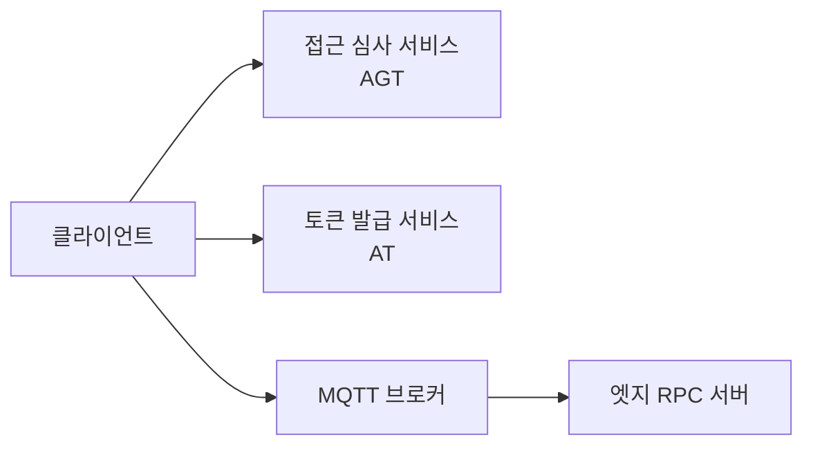

# MaaS RPC 인터페이스 정의서

> 문서 유형: 인터페이스 정의서
> 독자: 개발자, QA 엔지니어, 인프라 담당자
>
> MQTT 5.0 기반 MaaS RPC 통신에서 사용되는 토픽 패턴, 접근 제어 규칙, 인증·인가 정책을 정의한다.

---

## 1. 토픽 구조

모든 RPC 통신은 아래 구조를 따른다.

```
{WMT|WMO}/{ThingType}/{Service}/{VIN}/{ClientId}/{request|response}
```

### 세그먼트 정의

| 세그먼트 | 설명 | 예시 |
|----------|------|------|
| `WMT` | Web Mobile Terminated — 클라이언트 → 서비스 방향 | |
| `WMO` | Web Mobile Oriented — 서비스 → 클라이언트 방향 | |
| `{ThingType}` | 사물의 타입 분류. 특정 인스턴스 ID가 아닌 **타입** 식별자 | `CGU`, `SDM` |
| `{Service}` | ThingType 위에서 동작하는 서비스 이름 | `viss`, `diagnostics`, `control` |
| `{VIN}` | 대상 장비 식별자 (Vehicle Identification Number) | `VIN-123456` |
| `{ClientId}` | 응답 라우팅용 클라이언트 식별자. 고유 UUID 권장 | `webapp-uuid-abc` |
| `request` | 요청 메시지 | |
| `response` | 단일 RPC 응답, 스트리밍 이벤트(`is_EOF=false`), 또는 스트림 완료 신호(`is_EOF=true`) | |

> **핵심 원칙:** 클라이언트는 ThingType + Service + VIN만 알면 된다.
> 서비스가 실행되는 특정 Thing 인스턴스 ID는 노출되지 않는다.

---

## 2. 토픽 패턴별 용도

### 2.1 요청 (WMT)

| 항목 | 형식 |
|------|------|
| 패턴 | `WMT/{ThingType}/{Service}/{VIN}/{ClientId}/request` |
| 발행자 | 클라이언트 |
| 구독자 | 서비스 (ThingType, Service, VIN 고정, ClientId 와일드카드) |
| 예시 | `WMT/CGU/viss/VIN-123456/webapp-abc/request` |

### 2.2 응답 (WMO/response)

| 항목 | 형식 |
|------|------|
| 패턴 | `WMO/{ThingType}/{Service}/{VIN}/{ClientId}/response` |
| 발행자 | 서비스 |
| 구독자 | 클라이언트 (자신의 ClientId 고정) |
| 용도 | 단일 RPC 응답 / 스트리밍 이벤트 (`is_EOF=false`) / 스트리밍 완료 신호 (`is_EOF=true`) |

### 2.3 서버 생존 (WMO/heartbeat)

| 항목 | 형식 |
|------|------|
| 패턴 | `WMO/{ThingType}/{Service}/{VIN}/heartbeat` |
| 발행자 | 서비스 (주기 발행) |
| 구독자 | 클라이언트 |
| 용도 | 서버 프로세스 생존 신호. 패턴 C/E에서 클라이언트가 서버 단절 감지 |

### 2.4 클라이언트 단절 (WMT/offline) — LWT

| 항목 | 형식 |
|------|------|
| 패턴 | `WMT/{ThingType}/{Service}/{VIN}/{ClientId}/offline` |
| 발행자 | MQTT 브로커 (클라이언트가 CONNECT 시 LWT로 등록) |
| 구독자 | 서비스 (`WMT/{ThingType}/{Service}/{VIN}/+/offline`) |
| 용도 | 클라이언트 비정상 단절 시 브로커가 자동 발행. 서버가 패턴 C 구독 취소 / 패턴 E 세션 해제 |

> **LWT (Last Will and Testament):** 클라이언트 SDK가 패턴 C 구독 또는 패턴 E 세션 진입 시 이 토픽을 will로 등록한다. 비정상 단절 시 브로커가 대신 발행하여 서버가 감지한다. IoT Core lifecycle 이벤트와 달리 브로커 비종속(CCU pure MQTT 포함)이며, MQTT 표준 기능이다.

---

## 3. 서비스 구독 패턴

서비스는 자신의 ThingType, Service 이름, VIN을 기반으로 구독한다.
ClientId는 와일드카드(`+`)로 수신하여 모든 클라이언트의 요청을 처리한다.

```
WMT/{ThingType}/{Service}/{VIN}/+/request
```

예시 (CGU의 viss 서비스, VIN-123456 담당):

```
WMT/CGU/viss/VIN-123456/+/request
```

---

## 4. 클라이언트 구독 패턴

SDK가 `connect()` 시 아래 와일드카드 구독을 자동으로 등록한다.

```
WMO/+/+/+/{ClientId}/response
```

- 단일 응답과 스트리밍 이벤트(`is_EOF=false`/`true`) 모두 이 토픽으로 수신한다.
- `Correlation Data`로 요청-응답을 매핑한다.
- ThingType, Service, VIN은 와일드카드로 처리하여 모든 서비스로부터의 응답을 하나의 구독으로 수신한다.

패턴 C/E를 사용하면 서버 생존 감지를 위해 Heartbeat 토픽도 추가 구독한다.

```
WMO/{ThingType}/{Service}/{VIN}/heartbeat  (QoS 0)
```

---

## 5. 요청 페이로드 (애플리케이션 계약)

JSON 페이로드(권장)에서 다음 필드를 사용한다.

| 필드 | 필수 | 설명 |
|------|------|------|
| `action` | 예 | 실행할 애플리케이션 액션. 서버가 등록한 action 핸들러 이름과 매칭 |

`action` 외 필드는 서비스별 계약으로 자유롭게 정의한다. 서로 다른 서비스는 토픽의 `{Service}` 로 구분한다.

> **라우팅 키:** 규격상 권장 필드명은 `action`이다. 서버는 페이로드에서 라우팅에 쓸 **JSON 키**를 다른 이름(예: `method`, `op`)으로 설정할 수 있으며, 라우팅 키를 비활성화하면 본문을 분해하지 않고 전체를 단일 기본 핸들러에 넘긴다.

---

## 6. MQTT 5.0 Properties 사용 규약

RPC 통신에서 MQTT 5.0 Properties를 다음과 같이 활용한다.

| Property | 사용 위치 | 용도 |
|----------|-----------|------|
| `Response Topic` | 요청 PUBLISH | 서비스가 응답할 WMO 토픽. SDK가 자동 삽입 |
| `Correlation Data` | 요청/응답 PUBLISH | 요청-응답 매핑용 UUID bytes. SDK가 자동 처리 |
| `Message Expiry Interval` | 요청 PUBLISH (QoS 1) | 브로커가 오래된 요청을 폐기(패턴 D). SDK는 `timeout`과 동기화 |
| `Message Expiry Interval` | 응답 PUBLISH (QoS 1) | `max(1, ceil(timeout - 처리시간))`. 클라이언트 포기 후 stale 응답 브로커 잔류 방지 |
| `User Property: qos` | 요청 PUBLISH | 클라이언트가 사용한 QoS (`"0"` 또는 `"1"`). SDK 자동 삽입. Greengrass 브리지 환경에서 `msg.qos` 신뢰 불가 문제 해결. 서버가 응답 QoS 결정에 사용 |
| `User Property: timeout` | 요청 PUBLISH | 클라이언트 timeout 값(초). 서버가 응답 Message Expiry 계산에 사용 (`max(1, ceil(timeout - 처리시간))`) |
| `User Property: sent_at` | 요청 PUBLISH (패턴 D) | 요청 발신 Unix ms. 서버가 `now - sent_at > valid_for + 500ms` 검증으로 만료 명령 실행 방지 |
| `User Property: subscription_id` | 응답 PUBLISH | SDK가 자동 발번하는 UUID. 패턴 A: 단일 응답에 포함. 패턴 C: **모든 이벤트에 포함** (QoS 0 유실 대비). 클라이언트 SDK가 `stop()` 호출에 사용 |
| `User Property: session_id` | 응답 PUBLISH (패턴 E) | 독점 세션 식별자. `<uuid>`=세션 활성(클라이언트 SDK 감시 ON), `""`(빈 문자열)=세션 종료(감시 OFF), 키 없음=비독점 서비스. 세션의 진실 소스(client_id 아님) |
| `User Property: is_EOF` | 응답 PUBLISH | `"true"` — 마지막 응답 신호. 패턴 A: 항상 `"true"`. 패턴 C 이벤트: `"false"`, EOF: `"true"`. 클라이언트 SDK가 단일/스트림 자동 판별에 사용 |
| `User Property: unsubscribe_action` | 응답 PUBLISH (패턴 C) | 구독 취소 시 호출할 action 이름. 패턴 C **모든 이벤트에 포함** (QoS 0 유실 대비). 클라이언트 SDK의 `stop()` 이 자동 참조 |
| `User Property: reason_code` | 응답 PUBLISH | 처리 결과 코드 (0=성공, 0x80 이상=오류) |
| `User Property: error_detail` | 응답 PUBLISH | 오류 상세 메시지 (오류 시만 포함) |
| `User Property: cancel_reason` | 응답 PUBLISH (패턴 C EOF) | 서버 주도 강제 취소 시 사유. 클라이언트에서 강제 취소 사유로 전달 |

### 6.1 요청 JSON 예시

```json
{
  "action": "get",
  "path": "Vehicle.Speed"
}
```

### 6.2 응답 페이로드

응답 페이로드 구조는 서비스가 자유롭게 정의한다.
성공/실패 여부는 페이로드가 아닌 `User Property: reason_code`로 판단한다.

---

## 7. Reason Code 표준

서비스는 응답 시 User Property `reason_code`로 결과를 반환한다.

| 코드 | 의미 |
|------|------|
| `0` (0x00) | 성공 |
| `128` (0x80) | 알 수 없는 서버/하드웨어 오류 |
| `131` (0x83) | 비즈니스 로직 오류 (장비가 현재 수행 불가) |
| `135` (0x87) | 권한 없음 |
| `138` (0x8A) | 독점 세션 점유 중 (Server Busy) |
| `144` (0x90) | 지원하지 않는 action |
| `153` (0x99) | 페이로드 형식 오류 |

---

## 8. ACL 규칙

### 8.1 클라이언트 발행 (WMT)

- 클라이언트는 자신의 ClientId가 포함된 WMT 토픽에만 발행 가능
- LWT(`WMT/.../{ClientId}/offline`) 토픽도 자신의 ClientId 범위로 publish 권한이 있어야 브로커가 will을 발행함
- VIN 접근 권한은 인증 토큰(JWT) 기반으로 브로커/인가 서비스에서 검증

### 8.2 클라이언트 구독 (WMO)

- 클라이언트는 자신의 ClientId가 포함된 WMO 토픽만 구독 가능
- 서버 Heartbeat(`WMO/.../heartbeat`) 구독 가능
- 타 클라이언트의 응답 토픽 구독 차단

### 8.3 서비스 구독 (WMT)

- 서비스는 자신의 ThingType + Service + VIN 범위의 WMT 토픽만 구독 가능
- 요청(`+/request`)과 LWT(`+/offline`) 두 패턴 구독

---

## 9. Greengrass accessControl 패턴

Greengrass 환경에서 서버를 실행할 때 Greengrass component recipe에 필요한 IoT Core 권한 패턴이다.
(SDK가 이 권한 패턴을 자동 생성하는 헬퍼를 제공하는지는 [SDK 요구사양서](spec/SDK%20%EC%9A%94%EA%B5%AC%EC%82%AC%EC%96%91%EC%84%9C.md) 참조.)

Greengrass recipe `accessControl` 섹션 예시:

```yaml
accessControl:
  aws.greengrass.ipc.mqttproxy:
    maas:CGU:viss:subscribe:
      policyDescription: Allow subscribe to WMT request and offline(LWT)
      operations:
        - aws.greengrass#SubscribeToIoTCore
      resources:
        - WMT/CGU/viss/VIN-123456/+/request
        - WMT/CGU/viss/VIN-123456/+/offline    # 패턴 C/E LWT 수신
    maas:CGU:viss:publish:
      policyDescription: Allow publish to WMO response and heartbeat
      operations:
        - aws.greengrass#PublishToIoTCore
      resources:
        - WMO/CGU/viss/VIN-123456/+/response
        - WMO/CGU/viss/VIN-123456/heartbeat     # 패턴 C/E 서버 생존 신호
```

- 구독 토픽: `WMT/{ThingType}/{Service}/{VIN}/+/request` (요청), `.../+/offline` (LWT, 패턴 C/E)
- 발행 토픽: `WMO/{ThingType}/{Service}/{VIN}/+/response` (응답), `.../heartbeat` (생존 신호, 패턴 C/E)

---

## 10. 토픽 흐름 예시

### 10.1 단일 응답

```
[Client: webapp-abc]
PUBLISH  WMT/CGU/viss/VIN-123456/webapp-abc/request
  payload: {"action": "get", "path": "Vehicle.Speed"}
  MQTT5:   Response-Topic = WMO/CGU/viss/VIN-123456/webapp-abc/response
           Correlation-Data = <UUID-1>

[CGU viss Service, VIN-123456]
구독 중:  WMT/CGU/viss/VIN-123456/+/request
  → 수신 → action="get" → 핸들러 호출
PUBLISH  WMO/CGU/viss/VIN-123456/webapp-abc/response
  payload: {"value": 120.5}
  MQTT5:   Correlation-Data = <UUID-1>
           User-Property: reason_code=0

[Client: webapp-abc]
  → Correlation-Data 매핑 → Future resolved
  → result.payload = {"value": 120.5}
```

### 10.2 스트리밍 구독 (패턴 C)

response 토픽으로 이벤트 2개와 EOF를 전달하는 흐름이다. 유한 스트림(generator 자연 종료)도 동일 구조이며, 순서가 중요하면 서버가 QoS 1로 발행한다.

```
[Client: webapp-abc]
PUBLISH  WMT/CGU/diagnostics/VIN-123456/webapp-abc/request
  payload: {"action": "get_logs"}
  MQTT5:   Response-Topic = WMO/CGU/diagnostics/VIN-123456/webapp-abc/response
           Correlation-Data = <UUID-2>
           User-Property: qos=0

[CGU diagnostics Service]   (subscription=True, qos는 서버 선택)
PUBLISH  WMO/CGU/diagnostics/VIN-123456/webapp-abc/response   ← 이벤트 1
  payload: {"data": "...chunk1..."}
  MQTT5:   Correlation-Data = <UUID-2>
           User-Property: subscription_id=SUB-1, is_EOF=false, unsubscribe_action=unsubscribe

PUBLISH  WMO/CGU/diagnostics/VIN-123456/webapp-abc/response   ← 이벤트 2
  payload: {"data": "...chunk2..."}
  MQTT5:   Correlation-Data = <UUID-2>
           User-Property: subscription_id=SUB-1, is_EOF=false, unsubscribe_action=unsubscribe

PUBLISH  WMO/CGU/diagnostics/VIN-123456/webapp-abc/response   ← 종료 (generator 소진)
  payload: {}
  MQTT5:   Correlation-Data = <UUID-2>
           User-Property: subscription_id=SUB-1, is_EOF=true

[Client: webapp-abc]
  → Correlation-Data <UUID-2> 로 구독에 청크 매핑
  → is_EOF=true → 구독 종료
```

---

## 11. 인증·인가 정책

### 11.1 설계 원칙

1. **영구 자격증명 배제:** 영구 자격증명을 클라이언트 코드에 직접 포함하지 않는다. 사용자·장비 단위 권한은 비즈니스 백엔드에서 판단하고, 통신에는 단기 토큰(예: JWT)만 사용한다.
2. **최소 권한:** 세션당 허용 토픽은 `WMT` 발행·`WMO` 구독 범위로 최소한으로 제한한다. VIN 수준까지 세분화 가능하다.
3. **브로커 게이트:** 토큰 검증과 ACL 적용의 주체는 브로커 기능(네이티브 플러그인, 별도 프록시, Custom Authorizer 등)으로 둔다. 특정 브로커 제품을 규정하지 않는다.

### 11.2 참고 인증 아키텍처



- **접근 심사(AGT):** 사용자가 특정 장비·서비스를 호출할 수 있는지 비즈니스 규칙으로 판단
- **토큰 발급(AT):** 심사 결과를 바탕으로 짧은 수명 JWT 발급. 클레임에 `clientId`, `thingType`, `service`, `vin`, `allowed_actions` 등을 넣을 수 있다
- **브로커:** 연결 시 토큰을 검증하고, 해당 세션에 허용된 토픽만 Pub/Sub하도록 제한

### 11.3 JWT 클레임 예시 (비규범)

실제 클레임 구조는 브로커와 배포 환경과의 계약에 따른다.

```json
{
  "sub": "user-uuid-1234",
  "clientId": "web-client-xyz",
  "thingType": "CGU",
  "service": "viss",
  "vin": "VIN-123456",
  "allowed_actions": ["get", "set", "connect"],
  "exp": 1711234567
}
```

### 11.4 클라이언트 토큰 주입

클라이언트는 연결 시마다 단기 토큰(JWT 등)을 취득하는 콜백을 제공하여, 매 연결마다 최신 토큰을 브로커 설정에 맞게(예: MQTT username) 주입한다. JWT 클레임의 스코프(`thingType`, `service`, `vin`)와 클라이언트의 라우팅 범위가 일치하도록 한다.
(구체 API는 [SDK 요구사양서](spec/SDK%20%EC%9A%94%EA%B5%AC%EC%82%AC%EC%96%91%EC%84%9C.md) §5·§6 참조.)

### 11.5 토큰 갱신

JWT가 만료(`exp` 초과)되면 연결이 끊길 수 있다. 재연결 시 토큰 주입 콜백이 다시 호출되어 새 토큰을 취득한 뒤 `Clean Start = True`로 재연결한다.

### 11.6 엣지 서버 보안

엣지 RPC 서버는 브로커에 붙어 WMT 요청을 처리한다.

- **CCU (pure MQTT):** X.509 인증서로 로컬 브로커(EMQX)에 연결. pure MQTT 어댑터 사용
- **CGU (Greengrass):** Greengrass TES(Token Exchange Service)가 자격증명을 자동 처리. Greengrass IPC 어댑터 사용
- 독점 세션·단절 감지: 패턴 C/E 사용 시 서버가 LWT 토픽(`WMT/.../+/offline`)을 자동 구독하여 클라이언트 비정상 단절을 감지한다 (상세: CONNECTION_MANAGEMENT.md §7)
