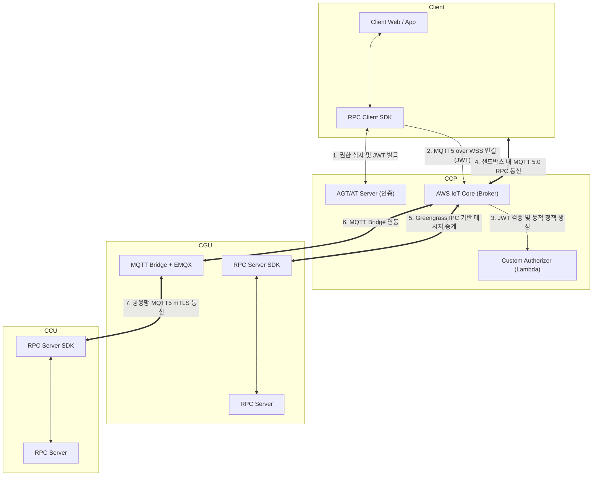

## 1. 개요

### 1.1. 배경 및 시스템 정의

SDM(Software Defined Machine)은 기계의 물리적 제어권을 소프트웨어 서비스로 추상화하는 차세대 건설기계 플랫폼이다. 본 사양서는 기계를 인터넷을 통해 언제 어디서든 호출 가능한 원격 엔드포인트로 만드는 **MaaS(Machine as a Service) RPC 프레임워크**의 요구사항을 정의한다. 통신 기반은 AWS IoT Core를 메시지 브로커로 삼는 **MQTT 5.0 over WSS** 프로토콜이며, 클라우드와 엣지 기기 간의 모든 비동기 RPC 메시지를 중계한다.

### 1.2. 시스템 구성 요소 요약

시스템은 크게 4가지 논리적 영역으로 구분된다.

- **인증 영역 (CCP, Auth):** 사용자 권한을 심사하는 AGT(Access Grant Token) 서버와 단기 수명 JWT를 발행하는 AT(Access Token) 서버.
- **클라우드 영역 (CCP):** 메시지 라우팅을 담당하는 AWS IoT Core(MQTT 5.0 Broker)와 WSS 연결 시 JWT를 검증하고 동적 샌드박스 정책을 렌더링하는 Custom Authorizer (Lambda).
- **엣지 영역**
    - **CGU:** 외부망과 내부망을 잇는 유일한 관문. AWS Greengrass V2 기반으로 구동되며, 실제 MaaS 서비스를 제공하는 RPC Server 와 CCU 메시지를 중계하는 EMQX 로컬 브로커 및 MQTT Bridge를 포함한다. 자세한 내용은 “Telemetry Gateway 시스템요구사양서” 참고
    - **CCU:** CCU 가 MaaS RPC 서비스를 제공하는 경우, CGU 의 로컬 브로커를 통해서만 클라우드와 데이터를 교환하며, RPC Server 를 구성한다. 구성원리는 망분리 정책을 참고

### 1.3. 핵심 설계 철학

- **서버 주도 서비스 정의:** 모든 API 규격과 권한 범위는 서버(RPC Server)가 정의하며, 허가되지 않은 토픽은 브로커 단에서 차단한다. RPC 서버는 CGU, CCU-Linux, CCU-AAOS 의 응용계층에서 구현한다.
- **최소 권한 샌드박스:** 영구 자격 증명을 배제하고, 단기 JWT를 통해 브로커 레벨에서 클라이언트를 격리한다.
- **심층 방어 아키텍처:** 제어 노드(CCU)를 인터넷에서 원천 격리(Air-Gapped)하고 오직 게이트웨이(CGU)만을 외부 접점으로 허용한다.
- **MQTT 5.0 네이티브:** Correlation Data, Response Topic 등 5.0 고유 기능을 활용해 통신 신뢰성을 확보한다.

---

## 2. 목적

- **통합 제어 플랫폼 구축:** 이기종 클라이언트가 동일한 규격으로 기계와 통신하는 단일 파이프라인 제공.
- **표준화된 비동기 인터페이스:** 다양한 도메인 서비스를 규격화된 RPC 패턴으로 추상화.
- **엔터프라이즈 보안 내재화:** 개발자가 별도 보안 로직을 구현할 필요 없이 프레임워크 자체에서 다계층 방어 강제.

---

## 3. 시스템 아키텍처



## 4. 기능 정의

본 장은 MaaS RPC 프레임워크를 구성하는 각 모듈의 세부 동작 원리, 데이터 스키마, 에러 처리 메커니즘, 보안 검증 절차를 실무 구현 관점에서 심층적으로 규정한다.

### 4.1. 다계층 인증 및 인가 시스템 (Auth Pipeline)

클라이언트의 엣지 접근은 어플리케이션 계층(비즈니스 로직)과 네트워크 계층(브로커)에 걸친 다단계 파이프라인을 통과해야 한다.

**접근 심사 로직 (AGT 서버)**

- **요청:** 클라이언트는 자신의 신원(User ID)과 제어하고자 하는 장비 ID, 그리고 요청하는 서비스 범위(Scope)를 AGT 서버에 제출한다.
- **처리:** AGT 서버는 현재 로그인한 사용자가 해당 장비를 제어할 정당한 권한이 있는지 판단하고, 허가된 범위가 담긴 승인 토큰(Grant Token)을 반환한다.

**JWT 발행 규격 (AT 서버)**

- **요청:** 클라이언트는 획득한 AGT를 AT 서버에 제출하여 실제 MQTT 통신에 사용할 JWT를 요청
- **JWT Payload (Claims) 요구 규격:**JSON
    
    발행되는 토큰 내에는 Custom Authorizer 람다가 샌드박스를 구축하는 데 필요한 메타데이터가 명확히 포함되어야 한다. (아래는 예시이므로, 상황에 따라 설계되어야 함)
    
    ```json
    {
      "sub": "user-uuid-1234",
      "VIN": "SDM-XXXX",
      "clientId": "web-client-xyz", 
      "scopes": ["CGU:VISS", "CCU:RemoteCranking", "CGU:RDMS",...],   // "Server:Service"
      "iat": 1710000000,   
      "exp": 1710003600    // 1시간 뒤 만료 
    }
    ```
    
    *(참고: JWT 수명(`exp`)은 만약의 탈취 상황에 대비하여 1시간 이내로 짧게 설정하는 것을 권장)*
    

**게이트키퍼 동작 (Custom Authorizer Lambda)**

클라이언트가 AWS IoT Core 엔드포인트로 WSS 연결을 요청할 때, 브로커는 사전 등록된 **Custom Authorizer 람다 함수**를 호출한다.

1. **무결성 검증:** AT 서버의 공개키(JWKS)를 이용하여 JWT의 서명(Signature), 만료 일자, 발급자가 유효한지 검증
2. **동적 정책(Dynamic Policy) 렌더링:** 토큰의 페이로드에서 `clientId`, `scopes` 등을 추출하여, 이 클라이언트가 브로커 내에서 수행할 수 있는 행위를 극도로 제한하는 맞춤형 IAM 정책 문서(JSON)를 즉석에서 생성
3. **접근 승인:** 렌더링된 정책 문서와 함께 '연결 허용(Allow)' 응답을 AWS IoT Core로 반환

**IAM Policy 예시**

```json
{
  "Version": "2012-10-17",
  "Statement": [
    {
      "Effect": "Allow",
      "Action": "iot:Connect",
      "Resource": "arn:aws:iot:region:account:client/${Token.clientId}"
    },
    {
      "Effect": "Allow",
      "Action": "iot:Subscribe",
      "Resource": [
        "arn:aws:iot:region:account:topicfilter/rpc/response/${Token.clientId}",
        "arn:aws:iot:region:account:topicfilter/telemetry/heartbeat/${Token.thingName}"
      ]
    },
    {
      "Effect": "Allow",
      "Action": "iot:Receive",
      "Resource": [
        "arn:aws:iot:region:account:topic/rpc/response/${Token.clientId}",
        "arn:aws:iot:region:account:topic/telemetry/heartbeat/${Token.thingName}"
      ]
    },
    {
      "Effect": "Allow",
      "Action": "iot:Publish",
      "Resource": [
        "arn:aws:iot:region:account:topic/rpc/request/status",
        "arn:aws:iot:region:account:topic/rpc/request/control/worklight"
      ]
    }
  ]
}
```

- **연결 제한 (`iot:Connect`):** 토큰에 명시된 고유한 `clientId`로만 연결을 허용하여, 다른 클라이언트로 위장하는 것을 방지
- **수신 제한 (`iot:Subscribe` & `iot:Receive`):** 오직 자신의 전용 응답 토픽과 허락된 타겟 장비 및 서버의 토픽만 엿볼 수 있도록 제한
- **발행 제한 (`iot:Publish`):** 토큰의 `scopes`배열을 기반으로 정책을 렌더링하여, 해당 클라이언트가 허가받은 RPC 엔드포인트(토픽)로만 명령을 전송할 수 있도록 통제

### 4.2. MQTT 5.0 통신 표준 및 프로토콜 규격

MQTT 3.1.1 사용을 전면 배제하고, 비동기 RPC의 신뢰성과 에러 추적성을 보장하는 MQTT 5.0 기능을 필수적으로 강제한다.

**Topic Pattern**

- 서비스 별로 단 3개의 토픽패턴으로 구성한다. (아래는 예시}
    - 요청: `{direction}/{Server}/{Service}/{VIN}/request`
    - 응답: `{direction}/{Server}/{Service}/{VIN}/{ClientId}/response`
    - 생존: `{direction}/{Server}/{Service}/{VIN}/+/heartbeat`  (클라이언트의 생존을 서버에게 공유하기 위해 +에 ClientId 추가 가능)
    
    > TODO: 서버의 생존은 Shadow 로 대체하고, 클라이언트의 생존은 LWT 로 대체하는 방안 검토
    - Greengrass Core Nucleus 는 IPC 로 LWT 를 지원하지 않음
    > 
- 페이로드 규칙
    - 페이로드 규칙은 서버에서 결정한다.
    - VISSv3 는 관련 표준을 따른다.
    - 그 외 RPC 는 가급적 JSON-RPC 2.0 패턴을 따른다.

**연결(Connect) 파라미터 정책**

- **클라이언트:** WSS 통신 특성상 네트워크 단절 시 브로커에 찌꺼기 메시지(Stale Message)가 남는 것을 방지하기 위해 무조건 `Clean Start=True`로 연결한다. `Session Expiry Interval`은 0으로 설정하여 연결 해제 시 세션을 즉시 파기한다.
- **엣지:** 오프라인 상태에서도 명령을 큐잉받고 재연결 시 쏟아내기 위해 `Clean Start=False`를 유지하며, `Session Expiry Interval`은 604800초(7일)로 설정한다.

**비동기 응답 매핑 (Correlation Data & Response Topic)**

MQTT5 에서 지원하는 `User_Property` 활용

- 클라이언트가 발행하는 모든 요청 메시지에는 고유 ID를 담은 `Correlation Data`와 자신의 전용 수신처인 `Response Topic` 속성, 그리고 `Request ID`가 삽입된다.
    
    > 통상 Request ID 는 페이로드의 영역이다. 단 MaaS RPC 에서는 RPC 패턴을 일반화하기 위해 중복이라 할지라도 Request ID 를 User Property 에도 삽입한다.
    > 
- 엣지의 RPC Server는 요청을 처리한 후, 수신한 `Correlation Data`를 복사하여 `Response Topic`으로 응답 메시지를 발행한다.

**응답 상태 코드 (Reason Code) 및 에러 상세**

HTTP의 상태 코드 체계와 유사하게, 모든 응답은 MQTT 5.0 표준 Reason Code를 포함한다.

- `0x00` (Success): 정상 처리.
- `0x80` (Unspecified Error): 엣지 하드웨어 타임아웃, 예외 발생 등 시스템 레벨 에러.
- `0x83` (Implementation Specific Error): 비즈니스 로직 검증 실패 (예: 주행 중 원격시동 불가). 이때 반드시 `User Property` 배열에 `error_detail` 키값으로 구체적 사유 코드를 첨부한다.
- `0x8A` (Server Busy): 패턴 E(독점 세션)가 타인에게 점유되어 명령 수행이 거부됨.

### 4.3. RPC 서비스 패턴 상세 명세

MaaS 서비스는 도메인 특성에 따라 다음 패턴 중 하나로 동작하며, 서버 개발자와 클라이언트 개발자 간의 인터페이스 계약 기준이 된다.

**패턴 A: 상태 및 정보 조회 (Liveness / Health Check)**

- **목적:** 센서 값, 장비 상태를 즉각 조회하는 읽기 전용 경량 통신.
- **통신 특성:**
    - 기본 통신 패턴
    1) 서버는 초기화 과정을 거쳐 명령을 받을 토픽을 구독한다.
    2) 클라이언트는 초기화 과정을 거쳐 응답을 받을 토픽을 구독한다.
    3) 클라이언트는 단말성 요청을 발행하고, 서버가 수신하면 요청 처리 후 클라이언트가 지정한 토픽으로 반환한다.
    - 메시지 유실에 민감하지 않으므로 **QoS 0**을 사용한다. 클라이언트는 요청 발행 후 타이머를 가동하며, 응답 지연 시 즉각 타임아웃 처리 후 UI를 Fallback 상태로 전환한다.

**패턴 B: 신뢰성 보장 단일 제어 (Reliable Control)**

- **목적:** 작업등 켜기, 도어락 작동 등 결과 보장이 필수적인 하드웨어 제어.
- **통신 특성:**
    - **QoS 1**을 사용하여 엣지까지의 도달을 보장한다.
    - 브로커와 엣지 구간에서 일시적 단절이 발생하더라도 엣지 복구 시 재전송된다.
    - 서버는 제어 로직(예: 릴레이 액추에이터 구동)이 완료된 시점에 명시적으로 응답을 반환한다.
    - 중복 수신 방지를 위해 엣지 측은 `Correlation Data` 기반의 멱등성(Idempotency) 검증 캐시를 유지한다.

**패턴 C: 시한성 안전 제어 (Time-bound Safety Command)**

- **목적:** 원격 시동, 긴급 정지 등 네트워크 지연 후 도착 시 심각한 안전 사고를 유발할 수 있는 통신.
- **통신 특성:**
    - **QoS 1**을 사용하여 엣지까지의 도달을 보장한다.
    - MQTT 헤더의 **Message Expiry Interval (MEI)을 2~3초로 엄격히 고정**한다. 브로커 스풀링 큐에 들어간 메시지라도 이 간격을 초과하면 브로커 단에서 자동 폐기되어 엣지로 전달되지 않는다.
    - MEI는 서버와 협의하여 결정한다. 단, 클라이언트가 MEI를 무시하거나 지나치게 길게 요청할 수 있으므로 페이로드에 timestamp 를 강제하여 서버가 요청의 유효성을 검증하도록 한다.
    서버는 수신 시 `abs(현재시각 - timestamp) > X초`일 경우 Replay Attack 또는 지연 전송으로 간주하고 `0x83` 에러를 반환한다.

**패턴 D: 멀티 응답 (Streaming Response)**

- **목적:** CAN 로그 추출, VSS 구독 등 1회성에 그치지 않고 지속적으로 응답해야 하는 서비스
- **통신 특성:**
    - 서버는 클라이언트 요청 토픽의 request ID 로 응답토픽을 발행한다.
    - 시퀀스 관리가 필요한 경우에는 페이로드에 시퀀스 번호를 부여한다.
    - 마지막 응답에는 `User Property: is_EOF=true` 마커를 삽입한다.
    - 서버는 클라이언트 단절 이벤트 구독(LWT 또는 Topic) 을 통해 연결 끊김 감지 시 즉시 응답을 중단한다.

**패턴 E: 독점 세션 제어 및 진단 (Exclusive Session)**

- **목적:** UDS ECU 진단, OTA 펌웨어 업데이트 등 장비 내부 자원을 독점해야 하는 서비스.
- **통신 특성:** TBD

### 4.4. 연결 관리 및 장애 복구 탄력성 (Resiliency)

**엣지망 단절 스풀링 정책**

CGU는 통신 음영 지역 진입 시 AWS IoT Core로 보내야 할 QoS 1 메시지를 로컬 파일시스템에 큐잉한다. 최대 7일간 보존되며, 메모리 고갈을 막기 위해 디스크 용량 초과 시 오래된 데이터부터 밀어내는 FIFO 정책을 적용한다. QoS 0 메시지(패턴 A 응답 등)는 스풀링하지 않고 즉시 폐기하여 I/O 부하를 낮춘다.

**클라이언트 투명 재연결 및 토큰 사전 갱신**

JWT 토큰의 최대 유효 기간(1시간) 도래에 따른 세션 강제 종료를 방지하기 위해, Client SDK는 JWT `exp` 타임스탬프 기준 만료 5분 전에 백그라운드 워커를 통해 새 토큰을 Fetching 한다. 

### 4.5. 계층별 SDK 설계 및 추상화 구조

개발 생산성 극대화와 통신 파이프라인 은닉을 위해 Server SDK와 Client SDK를 각각 제공한다.

**RPC Server SDK (엣지용 Python 기반)**

서비스 개발자가 MQTT 라우팅 복잡성을 알 필요 없이 비즈니스 로직에만 집중하도록 설계한다.

> **CGU 의 Python 기반 SDK 와 CCU 의 Python 기반 SDK 는 1세부에서 개발하여 제공합니다.
2세부는 Python 을 OS 및 어플리케이션 요청에 따라 언어를 확장합니다.**
> 
- **라우팅:** Flask와 유사한 데코레이터 패턴(`@rpc.handler(topic="control/horn", pattern="B")`)을 통해 토픽과 함수를 매핑한다.
- **동시성 처리:** 단일 제어 명령이 스트리밍 전송에 의해 블로킹되지 않도록 비동기 멀티스레딩 처리를 수행한다.
- **예외 캡처:** 핸들러 내에서 런타임 예외 발생 시 SDK가 이를 Intercept하여 트레이스백을 직렬화한 후 MQTT Reason Code `0x80`과 함께 클라이언트로 안전하게 반환한다.

**Client SDK (웹/모바일용 JS/TS, 모니터링용 Python, C# 등)**

웹 어플리케이션 개발자가 마치 로컬 REST API를 호출하는 것과 동일한 경험을 제공한다.

> **2세부에서 개발하여 제공합니다. 총괄 및 3세부에서 시험 검증합니다.**
> 
- `ConnectionManager`: JWT 발급 콜백 통합, WSS 연결 유지
- `RpcInvoker`: `call()` 및 `stream()` 등 비동기 인터페이스 제공. UUID 기반 상관관계 데이터 생성 및 타임아웃 타이머 가동.
- 에러 매핑: 수신된 `0x87` 코드를 언어 네이티브 예외인 `NotAuthorizedError`로, `0x8A`를 `ServerBusyError`로 역직렬화(Throw)하여 try-catch 블록 내의 우아한 에러 핸들링을 지원한다.

### 4.6. AWS IoT Device Shadow 상태 동기화 메커니즘 (TBD)

MaaS 서버의 온오프라인 상태, 잠금 현황, 서비스 카탈로그를 관리하기 위해 **Named Shadow 분리 아키텍처**를 적용한다.

**Shadow 분할 구조**

- `rpc-connectivity`: `status`, `last_boot_ts`, `last_heartbeat_ts` 등 가용성 상태. 클라이언트는 RPC 호출 직전 이 섀도우를 조회하여 가용성이 'online'인지 사전 검증한다.
- `rpc-services`: 현재 장비 펌웨어 버전에서 지원하는 서비스 토픽 목록과 QoS, 패턴 유형을 명시한 카탈로그 딕셔너리.
- `rpc-session`: 독점 세션(패턴 E)의 현재 `locked_by` 소유자 및 타임아웃 정보. (단, Shadow는 Eventual Consistency 모델이므로 실제 엄격한 뮤텍스 락은 엣지 메모리 상에서 처리하고 Shadow는 외부 가시화 용도로만 사용).
- `rpc-health`: 메모리 누수, CPU 과점, 에러 누적 횟수 등 시스템 건전성 메트릭.

**비정상 종료(Crash) 자동 감지 구조**

네트워크 단절이나 OOM(Out of Memory)으로 인해 CGU가 비정상 종료 시, Shadow 업데이트 로직을 스스로 수행할 수 없다. 이를 보완하기 위해 AWS IoT Core의 수명주기 이벤트(`presence/disconnected`)를 Rules Engine이 감지하여 트리거 Lambda를 구동한다. 이 Lambda가 해당 장비의 `rpc-connectivity` Shadow 상태를 'disconnected'로 강제 덮어쓰기(Update)하여, 모니터링 시스템과 클라이언트에 즉각적인 오프라인 알림(Delta)을 브로드캐스팅한다.

### 4.8. 핵심 응용 서비스 구현 규격

**VISSv3 (차량 신호 규격) 연동**

기계의 수천 개 내부 센서값을 W3C VISSv3 트리 구조 표준에 맞춰 노출한다.

- 패턴: 패턴 A, 패턴 D
- 로직: 요청 페이로드에 포함된 경로(예: `Vehicle.Chassis.Axle.WheelDiameter`)를 파싱하여 CCU 내장 메모리 맵에서 값을 즉시 인출, 타임스탬프와 함께 JSON 반환.

**원격 시동 안전 시퀀스**

안전 사고 직결 서비스이므로 극도로 보수적인 시퀀스를 강제한다.

- 패턴: 패턴 C
- 로직: 명령 수신 시 RPC Server는 즉시 시동 모터를 돌리지 않는다. ECU와 통신하여 1) 기어 파킹(P) 상태, 2) 도어락 체결 상태, 3) 엔진 회전수 0 상태의 3중 조건을 검증한다. 하나라도 위배 시 로직은 즉각 Rollback 처리되며, Reason Code `0x83`과 함께 구체적인 거부 사유가 클라이언트 UI로 전달된다.

**디지털키**

차량의 상태를 모니터링하며 적절한 명령을 수행한다.

- 패턴: 패턴 A, 패턴 B, 패턴 D
- 로직: 패턴 A, D 를 사용하는 VISSv3 를 이용하여 모니터링이 필요한 신호를 구독하여 실시간 상태를 디지털키 앱에 표시하고 관련된 제어 버튼을 활성화한다. 사용자가 활성화된 제어 버튼을 누르면 패턴 B 로 장비를 제어한다.

---

## 5. 제약 사항

1. **QoS 2 사용 금지:** 전체 시스템 레이어(클라우드, 엣지, 내부망) 어디에서도 브로커 리소스를 독점하는 MQTT QoS 2 레벨의 사용을 금지한다.
2. **단일 메시지 크기 제한:** 페이로드는 128KB를 절대 초과할 수 없다. 
3. **망 분리 강제:** 제어 노드(CCU)는 외부 접속을 위한 퍼블릭 IP 매핑 및 NAT 게이트웨이 접근이 금지된다.
4. **자격 증명 하드코딩 금지:** CGU 및 CCU 펌웨어 코드, 환경 변수에 AWS Access Key 등 영구 자격 증명을 평문 삽입하는 것을 금지하며, Greengrass TES(Token Exchange Service)를 통한 임시 증명 발급 메커니즘만 허용한다.

---

## 6. 성능 요구사항

시스템 아키텍처 및 코드는 다음의 성능 임계점을 충족하도록 설계되어야 한다.

- **대용량 처리 (Throughput):**
    - 단일 엣지는 초당 100건(100 RPS)의 RPC 요청을 지연 없이 동시 병렬 처리해야 함.
    - 텔레메트리 발행은 초당 1,000 TPS 수준을 수용.
- **보안 성능:** Custom Authorizer Lambda의 Warm Start 응답 속도는 500ms 이내.
- **자원 한계 (Resource Limits):** RPC Server 프로세스의 상시 CPU 점유율은 20% 이하로 유지.

---

## 7. 협의사항 (Open Items)

본 설계안의 성공적인 개발 착수를 위해 다음 항목들은 각 유관 팀과 우선적으로 협의를 마쳐야 한다.

1. **로컬 망(CCU) 서비스 화이트리스트:** MQTT Bridge를 통해 외부 MaaS 환경으로 노출할 CCU 내부 서비스들의 명확한 토픽 트리 구조와 노출 범위를 CCU 와 협의 결정.
2. **대안 통신망 로드맵:** 장기적으로 AWS IoT Core의 종속성을 줄이고 라이선스 비용을 절감하기 위한 순수 WSS, gRPC 브로커 전환 검토