> 원문: [VISSv3.1_Core.html](VISSv3.1_Core.html) | 출처: COVESA Vehicle Information Service Specification v3.1

# COVESA VISS 버전 3.1 — Core

**편집자:** Ulf Bjorkengren (Ford Motor Company), 이원석(Wonsuk Lee) (한국전자통신연구원 ETRI)

Copyright © 2026 COVESA®.

---

## 초록

Vehicle Information Service Specification(VISS)은 차량 네트워크 내 제어 장치 센서로부터 수집된 신호를 포함한 차량 정보에 접근하기 위한 서비스다. 이 정보는 COVESA [Hierarchical Information Model](https://github.com/COVESA/hierarchical_information_model)(HIM)에서 정의하는 계층적 트리 형태의 분류 체계로 노출되며, JSON 형식으로 제공된다. VISS 서비스는 차량 내부 또는 이미 오프보딩된 데이터를 사용하는 외부 서버에 호스팅될 수 있다.

VISS는 예측 유지보수, 사용 기반 보험, 차량 관리(플리트 매니지먼트), 실시간 운전 지원 서비스 등 광범위한 사용 사례를 지원한다. 인공지능 맥락에서 VISS는 중요한 데이터 접근 계층 역할을 하여 AI 알고리즘이 이상 탐지, 운전자 행동 분석, 에너지 최적화, 상황 인식 의사결정 등에 활용할 수 있는 고품질 실시간 차량 데이터를 제공한다.

VISS의 첫 번째 버전은 양산 차량에 구현 및 배포되었으며 WebSocket만 전송 프로토콜로 지원했다.
[두 번째 버전](https://github.com/COVESA/vehicle-information-service-specification/releases/tag/v2.0)은 HTTP 및 MQTT 전송 프로토콜도 지원하도록 일반화되어 다양한 사용 사례를 개선했으며, 구독 기능과 접근 제어 메커니즘도 추가되었다.
[세 번째 버전](https://github.com/COVESA/vehicle-information-service-specification/releases/tag/v3.0)은 gRPC 전송 프로토콜을 포함하고, 메시지 페이로드에만 규범적 요구사항을 부여함으로써 다른 전송 프로토콜 추가가 단순화되었다. 파일 전송, 페이로드 인코딩, 개선된 서버 기능 표현 등 새로운 기능들이 추가되었다.
이 사양, 버전 3.1은 세 번째 VISS 버전의 하위 호환 확장이다. 트리 내용 정의를 위한 VSS 규칙 집합 대신 HIM 차량 데이터 프로파일 규칙 집합을 참조한다. 이를 통해 VSS 트리 외의 다른 트리도 사용할 수 있으며, 서버는 클라이언트가 접근 가능한 트리 집합(포레스트)을 관리할 수 있다. 기타 변경 사항으로는 Unix 도메인 소켓 프로토콜 지원 및 포레스트 개념 지원을 위한 소규모 적응 사항(포레스트 조회 지원 등)이 있다.

이 사양은 세 부분으로 구성된다: CORE, [[TRANSPORT]], [[PAYLOAD ENCODING]]. 이 문서인 VISS 버전 3.1 CORE 사양은 VISSv3.1 메시징 계층을 설명한다.
VISSv3.1 전송 프로토콜 사양은 일부 전송 프로토콜에서 사용되는 CORE 정의의 편차를 설명하며, WebSocket 페이로드를 사용하여 JSON 기본 페이로드 형식을 예시한다. VISSv3.1 페이로드 인코딩 사양은 전송 중에 적용될 수 있는 페이로드 인코딩 설계를 설명한다.
이 사양은 [[IMPLEMENTATION_GUIDELINES]] 문서로 보완되며, 다양한 구현에서 클라이언트 상호운용성을 보장하기 위한 특정 기능 구현 권고사항을 제공한다.

---

## 1. 소개

이 사양은 VISS 프로토콜의 메시징 API를 설명한다. 여기에는 메시징 계층과 데이터 구조화 규칙 집합이 포함된다.
이 사양은 이 메시징 API와 데이터 규칙 집합을 준수하는 한 어떤 전송 프로토콜이 사용되는지에 관계없이 독립적이다. 전체 CORE 사양을 준수할 수 없는 전송 프로토콜은 [[TRANSPORT]] 사양에 편차를 기술하여 적합성을 가질 수 있다.
기본 페이로드 데이터 형식은 JSON이다. JSON 스키마([부록 A. JSON Schema](#a-json-schema))는 모든 페이로드를 정의한다. 전송 프로토콜이 다른 페이로드 인코딩(예: gRPC)을 사용하거나 보다 대역폭 효율적인 데이터 표현이 필요한 경우, 이 인코딩은 [[PAYLOAD ENCODING]] 사양에서 정의될 수 있다. 이 인코딩에는 JSON 페이로드 인코딩과 JSON 형식으로의 디코딩 솔루션이 모두 포함되어야 한다. 클라이언트는 JSON 형식의 메시지 페이로드에 접근할 수 있어야 한다.

메시지는 데이터의 표현을 보유하는 서버 구현과 아래 그림과 같이 데이터를 사용하는 클라이언트 사이에서 교환되며, 전송 프로토콜을 통해 전송 시 페이로드도 인코딩된다.

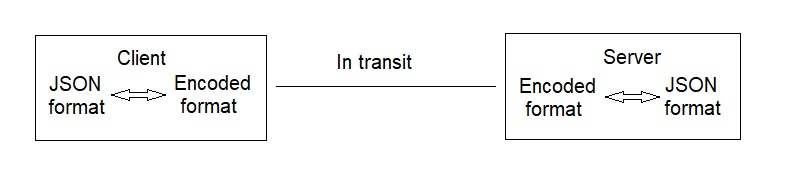

VISSv3.1 메시징 계층은 인터페이스를 통한 메서드 교환을 위한 RESTful 원칙을 기반으로 한다([5절. 인터페이스](#5-인터페이스) 참조).

VISSv3.1 데이터 구조화 규칙([HIM 차량 데이터 프로파일 규칙 집합](https://covesa.github.io/hierarchical_information_model/vehicle_data_rule_set/))은 모든 전송 프로토콜에서 동일하다. 서버가 보유하는 데이터 구조화의 기초는 트리 구조다.

---

## 2. 용어

'VISSv3.1'이라는 약어는 이 문서, VISS 버전 3.1 사양을 가리키는 데 사용된다. 'HIM'이라는 약어는 COVESA에서 호스팅하는 ['Hierarchical Information Model version 1.0 Vehicle Data profile'](https://github.com/COVESA/hierarchical_information_model)을 가리킨다. 'VSS'라는 약어는 COVESA에서 호스팅하는 ['Vehicle Signal Specification'](https://github.com/COVESA/vehicle_signal_specification)을 가리킨다. 이 사양에서 사용되는 'WebSocket'은 [W3C WebSocket API](https://www.w3.org/TR/websockets/) 및 RFC6455 WebSocket Protocol에 정의된 대로다.

### 2.1 정의

- **client(클라이언트)**: 서버가 관리하는 데이터와 상호작용하는 엔티티.
- **server(서버)**: 데이터를 관리하고 접근을 제공하는 엔티티.
- **success response(성공 응답)**: 오류가 발생하지 않았을 때 서버가 클라이언트에게 반환하는 메시지. 요청 유형별로 다르다.
- **error message(오류 메시지)**: 오류가 발생했을 때 서버가 클라이언트에게 반환하는 메시지. 동기 응답 메시지 또는 비동기 이벤트 메시지일 수 있다.
- **data point(데이터 포인트)**: 하나 이상의 값-타임스탬프 튜플을 포함하는 구조.
- **value(값)**: 하나 이상의 트리 노드와 연관된 데이터. 데이터 유형에 관계없이 단일 데이터 항목은 메시지 페이로드에서 항상 문자열로 표현된다.
- **timestamp(타임스탬프)**: 날짜와 시간 표현. [타임스탬프 절](#타임스탬프) 참조.
- **filter(필터)**: 클라이언트를 위한 데이터 선택 시 서버를 돕는 추가 정보.
- **authorization(인가)**: 클라이언트가 요청된 데이터에 대한 접근 권한이 있음을 검증 가능하게 증명하는 토큰. 서버가 제공하는 토큰 핸들로 표현될 수 있다.
- **subscriptionId**: 구독 세션을 식별하는 핸들.
- **requestId**: 클라이언트가 지정하는 고유 ID 값. 서버가 응답에서 반환하며 클라이언트가 요청과 응답 메시지를 연결하는 데 사용한다. 정수 또는 UUID(Universally Unique Identifier)일 수 있다.
- **purpose(목적)**: [목적 목록](#목적-목록)의 짧은 텍스트 항목 중 하나.
- **ECF**: External Consent Framework(외부 동의 프레임워크). 데이터 소유자에게 클라이언트의 데이터 접근 동의를 문의하는 역할을 하는 에이전트.
- **dc**: 서버 응답의 경로 및/또는 타임스탬프 데이터에 적용된 압축 체계를 식별하는 문자열.

---

## 3. 데이터 모델

이 서비스는 차량 데이터를 표현하기 위해 트리와 같은 논리적 분류 체계를 사용하도록 설계되었다. 아래 그림은 그러한 트리 구조의 예시다.

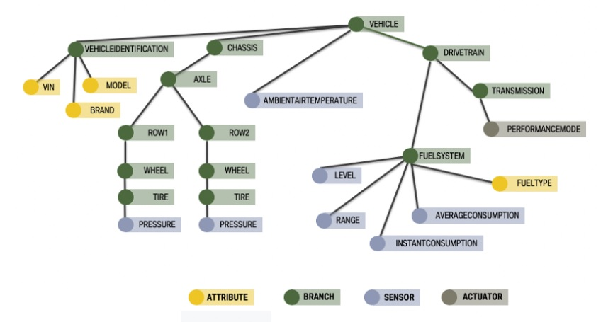

이전 VISS 버전은 트리 내용 정의를 위해 [VSS](https://github.com/COVESA/vehicle_signal_specification) 규칙 집합과 정의를 사용했지만, VISSv3.1에서는 [HIM](https://github.com/COVESA/hierarchical_information_model) 차량 데이터 프로파일 규칙 집합이 대신 사용된다. 이를 통해 VSS 트리 외의 다른 트리도 사용할 수 있다. 서버는 클라이언트가 접근할 수 있는 트리 집합, 즉 포레스트(forest)를 관리할 수 있다.

일반적으로 VISS 기반 서버 구현에서는 최소 세 가지 트리가 사용된다:

- **차량 트리**: 클라이언트가 접근 가능한 차량 신호를 포함하는 트리.
- **데이터 유형 정의 트리**: 차량 트리에서 사용되는 구조체(struct) 정의를 포함하는 트리. 허용 정의도 포함할 수 있다.
- **서버 기능 트리**: VISS 서버 구현이 지원하는 기능을 설명하는 데이터를 포함하는 트리.

차량 트리에 구조체 정의 또는 허용 정의에 대한 참조가 포함된 경우, 위 세 가지 트리가 모두 필수다. 차량 트리에 그러한 데이터 유형 참조가 없는 경우 데이터 유형 정의 트리는 생략할 수 있다.

서버 기능 트리는 하나의 트리로만 표현되어야 하며, 차량 트리와 데이터 유형 정의 트리는 여러 트리로 표현될 수 있다. 예를 들어 트럭이 하나 이상의 트레일러를 끄는 시나리오에서 트럭 차량 신호는 하나의 트리로, 각 트레일러의 신호는 별도의 트리로 표현될 수 있다. 이러한 각 트리는 별도의 데이터 유형 정의 트리를 사용할 수 있다.

서로 다른 트리는 HIM에 명시된 대로 고유한 루트 노드 이름을 가져야 한다.

"주" 차량 트리는 루트 노드 이름이 "Vehicle"이어야 한다. 이 이름은 [VSS](https://github.com/COVESA/vehicle_signal_specification)와의 호환성을 위해 필수다.

HIM은 데이터 유형 정의 트리의 루트 노드 이름이 "Types"로 시작해야 한다고 규정하며, 여러 트리를 구별하기 위해 이름을 추가로 붙일 수 있다.

서버 기능 트리의 루트 노드 이름은 "Server"여야 한다.

서버가 관리하는 트리 집합(포레스트)은 [HIM 구성](https://covesa.github.io/hierarchical_information_model/configuration_rule_set/) 파일에 정의된다.

VISS 호환 서버 구현은 차량 내부 또는 차량 외부에 배포될 수 있다. 차량 외부의 경우 일반적으로 이미 오프보딩된 데이터를 제공하는 클라우드에 위치한다.

### 3.1 주소 지정

리소스 주소 지정은 RFC3987에 정의된 URI를 사용하여 수행된다.

```
scheme://authority/path?query
```

- **scheme**: 주소 지정된 리소스에 도달하기 위해 사용할 프로토콜을 설명한다. 지원되는 프로토콜은 [[TRANSPORT]] 사양의 5절 Transport Protocols를 참조한다.
- **authority**: 리소스에 도달하는 위치를 설명한다.
- **path**: 리소스 내의 특정 서비스를 주소 지정한다.
- **query**: 주소 지정된 서비스와 관련된 추가 정보를 포함한다. [7절. 필터 요청](#7-필터-요청) 참조.

클라이언트에게 URI가 필요한 잠재적 리소스는 세 가지다:

- VISSv3 서버
- Access Grant Token 서버
- Access Token 서버

#### 3.1.1 Authority URI 컴포넌트

URI의 authority 컴포넌트는 IP 주소 또는 도메인 이름에 콜론과 포트 번호가 뒤따르는 형태로 구성된다.

##### IP 주소 / 도메인 이름

리소스의 배포 위치(클라우드 또는 차량)에 따라 도메인 이름 또는 IP 주소를 갖는다. 클라이언트는 에코시스템 매니저와의 상호작용을 통해 이 authority 컴포넌트 부분을 얻을 것으로 예상된다. 이 상호작용의 세부 사항은 이 사양의 범위를 벗어난다.

##### 포트 번호 (비규범적)

VISSv3 서버는 다양한 전송 프로토콜에 대해 다음 포트 번호를 사용해야 한다.

- HTTP 포트 번호 = 443
- WebSocket 포트 번호 = 6443
- MQTT 포트 번호 = 8883
- gRPC 포트 번호: 5443

Access Grant Token 서버는 포트 번호 7443을 사용해야 한다.
Access Token 서버는 포트 번호 8443을 사용해야 한다.

#### 3.1.2 Path URI 컴포넌트

Path URI 컴포넌트 정의는 세 가지 리소스에 따라 다르다.

**VISSv3 서버**의 경우: 경로는 구분자로 구분된 트리 노드 이름 순서로 구성된다. HIM은 점(.)을 구분자로 지정하므로 이 사양에서도 권장 선택이다. 그러나 HTTP URL에서는 슬래시(/)가 일반적인 구분자이므로 이 구분자도 지원된다. 예를 들어 Vehicle, Car, Engine, RPM 노드를 순회하는 경로 표현식은 "Vehicle.Car.Engine.RPM" 또는 "Vehicle/Car/Engine/RPM"이 될 수 있다. 같은 경로 표현식에서 구분자를 혼용하는 것은 피해야 한다. 경로에는 와일드카드 문자("*")가 포함되어서는 안 된다. 와일드카드가 필요한 경우 [경로 필터 작업](#경로-필터-작업) 참조.

**Access Grant Token 서버**의 경우: 경로는 "agts"다.

**Access Token 서버**의 경우: 경로는 "ats"다.

### 3.2 데이터 표현

단일 데이터 포인트는 메시지 페이로드에서 값과 연관된 타임스탬프로 표현되며, JSON에서는 키 이름 "value"와 "ts"를 가진 두 키-값 쌍으로 표현된다.

"ts" 값은 [타임스탬프 절](#타임스탬프)에 명시된 대로 문자열이어야 한다.
"value"는 단순 데이터 유형의 경우 문자열로 표현되어야 한다. 값이 배열인 경우 문자열의 JSON 배열로 표현되어야 한다. 값이 구조체 복합 데이터 유형인 경우 아래와 같이 JSON 객체로 표현되어야 한다. 지원되는 데이터 유형은 [HIM Data Types](https://covesa.github.io/hierarchical_information_model/common_rule_set/data_entry/datatypes/)를 참조한다.

숫자 값은 RFC8259에 명시된 숫자 형식을 따라야 하지만, 앞서 언급했듯이 문자열로 표현된다. 불리언 값은 "true" 또는 "false" 문자열 중 하나로 표현되어야 한다.

구조체 복합 데이터 유형은 다음과 같이 JSON 객체로 표현되어야 한다. 다음 선언을 가진 구조체:

```
struct {
    field1 datatype
    field2 datatype
}
```

는 다음 JSON 객체로 표현된다:

```json
{"field1":"X", "field2":"Y"}
```

여기서 X와 Y는 각 데이터 유형의 실제 값이다. 구조체 필드의 데이터 유형은 구조체를 포함하여 HIM이 지원하는 모든 데이터 유형일 수 있다.

여러 데이터 포인트의 표현에 대해서는 [응답 구문](#응답-구문) 참조.

데이터가 올바르게 표현되지 않은 경우 번호 400, 이유 "invalid_data"를 포함하는 오류 메시지가 반환되어야 한다.

---

## 4. 인터페이스

이 절은 클라이언트와 서버 간의 통신을 관장하는 다양한 메서드와 그 인수를 설명한다.

### 4.1 메서드

이러한 메서드를 구현하는 전송 프로토콜은 Read와 Update 메서드를 지원해야 하며, Subscribe, Unsubscribe, Subscription 메서드를 지원할 수 있다.

#### 4.1.1 Read (읽기)

**목적**: 주어진 경로로 주소 지정된 하나 이상의 값을 가져온다.

클라이언트는 요청된 값에 접근하기 전에 인가 토큰을 얻어야 할 수 있다. 서버가 요청을 성공적으로 처리하면 성공 응답을 반환해야 한다. 서버가 요청을 이행하지 못하면 오류 메시지를 반환해야 한다.

인수 (path는 필수):
- **path**: HIM에서 정의한 트리 내 노드 경로.
- **filter**: 요청된 데이터를 세분화하기 위한 추가 매개변수.
- **authorization**: 인가 토큰.
- **dc**: 전송된 데이터에 사용되는 압축 체계.

성공 응답 (authorization은 선택적):
- **data**: 하나 이상의 경로-데이터 포인트 집합을 포함하는 구조.
  - **path**: 연관된 데이터 포인트의 HIM 경로.
  - **data point**: 하나 이상의 값-타임스탬프 튜플을 포함하는 구조.
    - **value**: 사용 가능한 최신 값. 액추에이터의 경우도 설정된 목표값이 아닌 현재 값을 반환한다.
    - **timestamp**: 값의 수집 시간.
- **authorization**: 인가 토큰을 나타내는 핸들.
- **timestamp**: 요청의 서버 실행 시간.

#### 4.1.2 Update (업데이트)

**목적**: 경로로 주소 지정된 차량 신호에 변경된 값을 제공한다.

클라이언트는 차량 신호 업데이트 전에 인가 토큰을 얻어야 할 수 있다. 서버가 요청을 성공적으로 처리하면 성공 응답을 반환해야 한다. 그렇지 않으면 오류 메시지를 반환해야 한다. 액추에이터 유형 신호만 업데이트할 수 있다. 성공 응답이 업데이트된 목표 값으로의 구동 시도가 성공했거나 성공할 것을 보장하지 않는다는 점에 주의해야 한다. 클라이언트는 액추에이터 값을 이후에 읽는 방식으로 구동 진행 상황을 모니터링할 수 있다.

서버는 요청의 타임스탬프를 사용하여 가장 최근에 성공적으로 처리된 요청보다 이전에 발행된 요청을 버릴 수 있으며, 이후 오류 응답을 반환할 수 있다. 자세한 내용은 [부록 C. 순서 어긋난 요청](#c-순서-어긋난-요청) 참조.

인수 (path와 value는 필수):
- **path**: 트리 내 리프 노드의 HIM 경로.
- **value**: 지정된 경로의 차량 신호를 업데이트할 새로운 값.
- **authorization**: 인가 토큰.
- **timestamp**: 요청의 클라이언트 발송 시간.

성공 응답 (authorization은 선택적):
- **authorization**: 인가 토큰을 나타내는 핸들.
- **timestamp**: 요청의 서버 실행 시간. 신호의 최종 업데이트 시간과 다를 수 있다.

#### 4.1.3 Subscribe (구독)

**목적**: 경로로 주소 지정된 값을 포함하는 비동기 메시지를 가져온다. 이벤트 트리거 조건은 필터 규칙에 의해 결정된다.

클라이언트는 차량 신호 구독 전에 인가 토큰을 얻어야 할 수 있다. 서버는 트리거 규칙이 충족되면 이벤트 메시지를 발행해야 한다. 서버가 요청을 성공적으로 처리하면 성공 응답을 반환해야 한다. 서버가 요청을 이행하지 못하면 오류 메시지를 반환해야 한다. 구독 기간 동안 오류가 발생하면 서버는 오류 메시지를 반환해야 한다.

인수 (path와 filter는 필수):
- **path**: HIM에서 정의한 트리 내 노드 경로.
- **filter**: 비동기 이벤트 메시지의 트리거 기준을 정의하는 규칙 집합.
- **authorization**: 인가 토큰.
- **dc**: 전송된 데이터에 사용되는 압축 체계.

성공 응답 (authorization은 선택적):
- **authorization**: 인가 토큰을 나타내는 핸들.
- **subscriptionId**: 구독 세션의 고유 식별자.
- **timestamp**: 구독 기간의 시작 시간.

#### 4.1.4 Unsubscribe (구독 취소)

**목적**: subscribe 요청을 통해 이전에 설정된 구독을 종료한다.

서버가 요청을 성공적으로 처리하면 성공 응답을 반환해야 하며, 구독 핸들과 연관된 이벤트 메시지 발행을 중단해야 한다. 서버가 요청을 이행하지 못하면 오류 메시지를 반환해야 한다.

인수 (subscriptionId는 필수):
- **subscriptionId**: 구독 세션의 고유 식별자.

성공 응답:
- **timestamp**: 구독이 종료된 시간.

#### 4.1.5 Subscription (구독 이벤트)

**목적**: subscribe 요청 트리거 규칙이 충족될 때 클라이언트에게 비동기 이벤트 메시지를 전송한다.

서버는 구독과 연관된 트리거 규칙이 충족될 때 이벤트 메시지를 발행해야 한다. 서버가 트리거 규칙을 이행할 수 없으면 오류 메시지를 발행하고 구독을 종료해야 한다.

인수 (모두 필수):
- **subscriptionId**: 구독 세션의 고유 식별자.
- **data**: 하나 이상의 경로-데이터 포인트 집합을 포함하는 구조.
  - **path**: 연관된 데이터 포인트의 HIM 경로.
  - **data point**: 하나 이상의 값-타임스탬프 튜플을 포함하는 구조.
    - **value**: 필터 표현식과 연관된 현재 값.
    - **timestamp**: 값의 수집 시간.
- **timestamp**: 구독 이벤트의 서버 실행 시간.

### 4.2 오류 메시지

서버는 동기 오류 응답 또는 이전 구독 요청으로부터 발생하는 비동기 오류 이벤트로서 상호작용 중 발생하는 모든 오류를 클라이언트에게 알려야 한다. 오류 메시지에는 세 가지 인수가 있으며, subscriptionId는 오류 이벤트의 경우에만 필수다. 서버가 오류 이벤트를 발행하는 경우 연관된 구독 세션은 이후 서버에 의해 종료되어야 한다.

인수:
- **error**: 오류 정보 (아래 참조)
- **subscriptionId**: 구독 세션에 대한 참조.
- **timestamp**: 오류가 발생했을 때의 서버 실행 시간.

#### 4.2.1 오류 정보

오류 정보는 세 가지 구성 요소로 이루어진다: number(번호), reason(이유), description(설명). 세 구성 요소 모두 오류 정보에 포함되어야 한다.

- **number**: [[TRANSPORT]] 사양의 4.1 Status Codes 절 참조.
- **reason**: [[TRANSPORT]] 사양의 4.1 Status Codes 절 참조.
- **description**: [[TRANSPORT]] 사양의 4.1 Status Codes 절 참조.

### 4.3 타임스탬프

전송 페이로드의 타임스탬프는 후행 Z가 있는 UTC 형식을 사용하여 ISO8601 표준을 준수해야 한다. 시간 해상도는 최소 초 단위여야 하며, 필요에 따라 밀리초 이하 해상도를 선택적으로 지원한다. 날짜와 시간 형식은 아래와 같으며, 서브초 데이터와 구분자는 선택적이다.

```
YYYY-MM-DDTHH:MM:SS.ssssssZ
```

예외 사항으로 토큰 내 타임스탬프는 Unix 시간을 준수해야 하며, 타임스탬프 데이터 압축이 적용된 경우도 예외다.

---

## 5. 보안 고려사항

### 5.1 전송 보안

이 사양이 지원하는 전송 프로토콜은 RFC5246에 정의된 TLS v1.2를 사용해야 한다.

### 5.2 데이터 보안

접근 제어 모델은 전송 프로토콜 수준에서 접근이 허가된 클라이언트에 대한 데이터 접근 제한 적용을 가능하게 한다.

### 5.3 개인정보 보호 고려사항

이 사양 자체의 일부 개인정보 보호 조항 외에도, COVESA와 W3C는 민감한 정보 처리를 위한 추가적인 고려사항을 제공하는 시스템 및 지침 수립 활동을 진행하고 있다.

차량 내에서만 데이터를 참조하고, 외부로 전송하지 않으며, 재시작 시 지속되지 않는 경우와 같은 특정 사용 사례에서는 개인정보 보호 우려가 최소화되거나 존재하지 않을 수 있다.

이 사양은 세분화된 접근 제어 기능을 통해 애플리케이션이 접근할 수 있는 정보에 제한을 둘 수 있다. 또한 VISS 서비스에서 클라이언트 애플리케이션으로 전송되는 모든 데이터는 개인정보 보호를 위해 암호화된 프로토콜을 통해 전송되어야 한다.

차량 데이터에 접근하는 클라이언트는 관할권 및 소유권에 따라 달라지는 권한 있는 엔티티로부터 동의를 얻어야 할 수 있다. 이 사양은 VISS 서버 내에서 동의 관리를 위해 ECF(External Consent Framework)와의 통합을 지원한다([동의 지원](#동의-지원) 참조). 동의는 취소 가능해야 하지만, 취소 프로세스는 이 사양의 범위를 벗어나며 규정 또는 계약 약정에 의해 관할될 수 있다.

---

## 6. 필터 요청

필터링은 클라이언트 요청을 세분화하여 반환된 응답 데이터에 대한 더 정밀한 제어를 제공하는 메커니즘이다. 필터링은 읽기 요청과 구독 요청 모두에 적용될 수 있다.

필터링이 포함된 요청 구조:

- HTTP 프로토콜의 경우:
  ```
  GET /<himpath>?filter=<filter-expression>
  ```
- JSON 기본 페이로드 형식을 사용하는 프로토콜의 경우:
  ```json
  {"action":"get", "path":"<himpath>", "filter":"<filter-expression>"}
  ```

여기서:
- `get`: 전송 프로토콜 메서드
- `himpath`: 트리 루트부터 시작하는 HIM 경로
- `filter`: 필터 표현식의 키 이름
- `filter-expression`: 필터 지시사항

필터 표현식의 객체 형식:

```json
{"variant":"<x>", "parameter":"<y>"}
```

여기서:
- **variant**: 필터 작업 변형의 키 이름. 다음 값 중 하나를 가질 수 있다:
  - **paths**: 하나 이상의 상대 경로. 여러 경로 사용 시 배열 표현식 적용.
  - **timebased**: 고정 시간 간격으로 데이터 수집.
  - **range**: 값이 주어진 범위 내에 있을 때 데이터 수집.
  - **change**: 마지막 수집 이후 값이 고정 값 이상 변경될 때 데이터 수집.
  - **curvelog**: 수집된 데이터가 클라이언트에게 전송되기 전에 [곡선 로깅](https://www.geotab.com/blog/gps-logging-curve-algorithm/) 알고리즘에 따라 처리됨.
  - **history**: 현재 시간부터 과거로 소급하는 기간의 수집된 데이터.
  - **metadata**: 응답이 주소 지정된 서브트리의 메타데이터를 포함함.
- **parameter**: 필터 작업에 필요한 선택적 구성 데이터의 키 이름. 매개변수 데이터는 변형에 따라 다르다.

서버는 timebased와 change 변형을 지원해야 하며, 다른 변형들은 선택적이다. JSON 객체에서 "variant"와 "parameter" 키-값 쌍은 항상 존재해야 한다. 여러 필터 표현식이 하나의 구독 요청에 결합될 수 있다.

다음 사항이 지원되어야 한다:
- variant "paths"를 가진 객체 최대 하나와 지원되는 다른 변형을 가진 객체 최대 하나로 구성될 수 있는 JSON 표현식. 이들은 AND 연산자로 논리적으로 결합된다.
- timebased, range, change, curvelog 변형은 구독 요청에서만 사용 가능.

서버는 선택적으로 필수 지원 외의 다른 필터 조합을 지원할 수 있다. 이 경우 이러한 조합은 필터 변형 이름을 더하기 기호(+)로 구분하여 서버 기능 트리의 Server.Support.Filter 노드 문자열 배열에 선언되어야 한다. 예를 들어 timebased 필터와 change 필터의 조합은 배열에서 "timebased+change"로 표현된다.

구독 요청은 HTTP 전송 프로토콜에서 지원되지 않는다.

### 6.1 경로 필터 작업

경로 필터 작업은 단일 요청이 트리의 여러 데이터 포인트에서 신호 데이터를 검색할 수 있게 한다. himpath는 이 노드에서 시작하는 필터 매개변수 객체의 상대 경로들의 공통 마지막 노드를 가리켜야 한다. 필터 값의 경로 끝점이 브랜치인 경우 그 브랜치 아래 서브트리의 모든 리프 노드가 포함되어야 한다. 필터 값의 경로는 단일 경로 세그먼트를 나타내는 와일드카드 문자(*)를 포함할 수 있다.

값 배열의 모든 경로 요소는 트리에서 최소 하나의 노드를 주소 지정해야 한다. 일치하는 노드가 없으면 서버는 오류 메시지를 반환해야 한다.

### 6.2 히스토리 필터 작업

기본적으로 서버는 일반적으로 신호를 나타내는 최신 데이터 포인트에만 접근할 수 있다. 그러나 특정 조건에서 서버는 일시적으로 과거 데이터 포인트를 저장하고 접근을 제공할 수 있다. 예를 들어 차량이 터널을 통과할 때와 같이 연결이 일시적으로 끊기는 경우다. 히스토리 기간은 현재 시간에서 과거 방향으로 현재 값을 제외하고 연장되어야 한다. 기간은 ISO8601 기간 형식으로 표현되어야 하며 일, 시, 분, 초로 표현된다. 예: `"parameter": "PdddDThhHmmMssS"`. 일 수는 999 미만이어야 한다.

### 6.3 시간 기반 필터 작업

매개변수 객체에는 수집 간격 기간 시간 X가 포함된다: `{"period":"X"}`. X는 정수이며 밀리초 단위의 기간 시간을 나타낸다.

### 6.4 범위 필터 작업

범위 필터 작업은 두 가지 유형의 범위를 지원한다. 값은 숫자 데이터 유형이어야 한다.

#### 단일 경계 범위

단일 "경계 연산자"는 현재 신호 값을 단일 경계와 비교하여 평가한다. 조건이 참으로 평가되면 서버는 구독 클라이언트에게 신호 값을 포함하는 이벤트 메시지를 발행해야 한다. 경계 연산자는 아래 나열된 값 중 하나여야 한다.

예시:
```
{"logic-op":"gt", "boundary": "5"}  // x > 5
{"logic-op":"eq", "boundary": "5"}  // x == 5
```

#### 다중 경계 범위

다중 경계 범위는 두 경계에 대해 현재 신호 값을 평가한다. 두 평가의 논리적 결과는 AND/OR 연산의 입력으로 사용된다. 첫 번째 객체에는 "AND" 또는 "OR" 값을 가져야 하는 선택적 "combination-op" 키-값 쌍이 포함될 수 있으며, 생략 시 두 경계 평가 결과는 AND 연산으로 기본 설정된다.

예시:
```json
[{"logic-op":"gt", "boundary": "5"},{"logic-op":"lt", "boundary": "10"}]  // x > 5 AND x < 10
[{"logic-op":"lt", "boundary": "5", "combination-op":"OR"},{"logic-op":"gt", "boundary": "10"}]  // x < 5 OR x > 10
```

지원되는 경계 연산자: `["eq", "ne", "gt", "gte", "lt", "lte"]` — 각각 "같음", "같지 않음", "보다 큼", "이상", "보다 작음", "이하"를 의미한다.

### 6.5 변경 필터 작업

변경 필터 작업은 지정된 조건에 따라 이전 값과 현재 값 사이의 차이를 감지한다. diff 값은 숫자 또는 불리언 데이터 유형이어야 한다.

매개변수 객체: `{"logic-op":"X", "diff":"Y"}` — X는 지원되는 논리 연산자 중 하나이고 Y는 필요한 변경 값이다.

불리언 값에 대해 지원되는 표현식:
- `{"logic-op":"gt", "diff": "0"}`: false→true로 변경될 때 이벤트 트리거.
- `{"logic-op":"lt", "diff": "0"}`: true→false로 변경될 때 이벤트 트리거.
- `{"logic-op":"ne", "diff": "0"}`: true→false 또는 false→true로 변경될 때 이벤트 트리거.

"ne" 논리 연산자와 zero(0) diff는 문자열 데이터 유형의 변경 추적에도 사용 가능하다.

### 6.6 곡선 로깅 필터 작업

곡선 로깅 필터 작업은 시계열 신호를 단순화하면서 필수 특성을 유지하여 데이터를 압축한다.

매개변수 객체: `{"maxerr": "X", "bufsize":"Y"}` — X는 샘플링된 데이터 포인트와 단순화된 곡선 사이의 최대 허용 오차를 나타내는 부동소수점 값이고, Y는 버퍼 요소 수다. 데이터는 버퍼가 가득 찰 때 처리되고 핵심 데이터 포인트만 신호별 시계열로 반환된다.

### 6.7 메타데이터 필터 작업

메타데이터 요청은 클라이언트가 실제 신호 데이터 대신 트리 노드와 연관된 메타데이터를 검색하는 "신호 탐색(signal inquiry)"을 수행할 수 있게 한다. 요청의 경로는 리프 노드나 브랜치 노드를 가리킬 수 있다. 필터 표현식의 "parameter" 값은 메타데이터가 최대로 반환될 하위 세대 수를 설정한다. 0으로 설정하면 주소 지정된 노드를 루트로 하는 전체 서브트리가 반환된다.

#### 포레스트 조회 (Forest Inquiry)

메타데이터 요청은 클라이언트가 서버가 관리하는 트리 집합에 대한 정보를 검색하는 "포레스트 조회(forest inquiry)"에도 사용될 수 있다. 이 요청은 루트 노드 이름 "HIM"으로 시작하는 경로를 가져야 하며, 포레스트 내 특정 트리를 주소 지정하기 위해 하나의 점으로 구분된 세그먼트 이름을 추가할 수 있다. 응답에는 로컬 파일 시스템의 트리 경로를 포함하는 "local" 속성을 제외한 HIM 구성 파일의 모든 주소 지정된 메타데이터가 포함된다.

포레스트 조회 요청은 HIM 구성 파일 데이터에 허용되는 유일한 요청 유형이며, 다른 모든 요청은 오류 응답을 받는다.

### 6.8 복수 신호 요청

필터링 작업은 단일 요청 내에서 트리의 여러 노드를 주소 지정하는 데 사용될 수 있다.

#### 오류 처리

복수 신호 요청에 대한 오류 메시지는 단일 신호 요청과 동일하게 처리되지만, 하나 이상의 신호가 일시적으로 사용 불가능한 경우는 예외다. 이 경우 서버는 인라인 오류 보고를 사용할 수 있다([[TRANSPORT]] 사양의 4.1.1 In-line Error Reporting 참조).

#### 응답 구문

응답에는 여러 노드가 주소 지정되거나 한 신호에 대해 여러 값이 반환되어 여러 값이 포함될 수 있다. 이 두 이유는 결합될 수 있어 네 가지 경우가 생긴다:

- 단일 노드에서 단일 값 요청
- 단일 노드에서 복수 값 요청
- 복수 노드에서 단일 값 요청
- 복수 노드에서 복수 값 요청

데이터 포인트("dp")는 "value"와 타임스탬프("ts")를 포함하는 하나 이상의 객체로 구성되고, 전체 집합("data")은 "path"와 데이터 포인트("dp")를 포함하는 하나 이상의 객체로 구성된다.

**단일 노드에서 단일 값에 대한 응답:**
```json
"data": {
  "dp": {
    "ts": "Z",
    "value": "Y"
  },
  "path": "X"
}
```

**단일 노드에서 복수 값에 대한 응답:**
```json
"data": {
  "dp": [
    {"ts": "Z1", "value": "Y1"},
    {"ts": "Zn", "value": "Yn"}
  ],
  "path": "X"
}
```

**복수 노드에서 단일 값에 대한 응답:**
```json
"data": [
  {"dp": {"ts": "Z1", "value": "Y1"}, "path": "X1"},
  {"dp": {"ts": "Zm", "value": "Ym"}, "path": "Xm"}
]
```

**복수 노드에서 복수 값에 대한 응답:**
```json
"data": [
  {
    "dp": [
      {"ts": "Z11", "value": "Y11"},
      {"ts": "Z1n", "value": "Y1n"}
    ],
    "path": "X1"
  },
  {
    "dp": [
      {"ts": "Zm1", "value": "Ym1"},
      {"ts": "Zmn", "value": "Ymn"}
    ],
    "path": "Xm"
  }
]
```

#### 구독 이벤트 트리거

구독 요청에는 서버가 비동기 이벤트 메시지를 발송하게 하는 트리거 이벤트를 정의하는 필터 작업이 포함되어야 한다. "range"와 "change" 필터 변형의 경우 트리거는 신호 값에 따라 결정된다. 요청이 여러 신호를 주소 지정하는 경우 트리거 조건은 경로 매개변수 배열의 첫 번째 신호에 대해서만 평가되어야 한다. 배열의 첫 번째 경로는 트리거 신호를 결정하므로 와일드카드를 포함해서는 안 된다.

---

## 7. 접근 제어 모델

이 절은 [GDPR(일반 데이터 보호 규정)](https://gdpr-info.eu)에 맞춰진 접근 제어 모델을 정의한다. 일반적인 프로세스는 클라이언트가 Access Grant Token 서버에서 특정 역할로 인증하는 것으로 시작한다. 성공하면 Access Grant Token을 받는다. 이 토큰은 Access Token 서버에 접근 요청 시 하나 이상 사용될 수 있다. 요청에는 AGT와 목적이 포함된다. ATS에 대한 요청이 성공하면 클라이언트는 승인된 목적과 관련된 하나 이상의 신호에 접근하기 위한 VISSv3 서버 요청에 사용할 수 있는 Access Token을 받는다.

접근 제어는 지원되어야 한다. 그러나 이 절에서는 클라이언트와 VISSv3 서버 간의 상호작용을 설명하는 부분만이 필수다.

접근 제어는 트리 버전 데이터를 포함하는 트리 노드 또는 서버 기능이나 트리에 적용된 접근 제어 선택 태그에 대한 동적 메타데이터 클라이언트 요청에 적용되어서는 안 된다.

### 7.1 아키텍처 (비규범적)

VISSv3 접근 제어 모델은 OAuth2.0(RFC6749)에서 영감을 받았지만 다음 절에서 설명하는 일부 편차가 있다.

아키텍처는 네 가지 주요 액터를 정의한다:

- **클라이언트**: 사용자를 대신하여 보호된 리소스에 대한 인가된 요청을 하는 애플리케이션.
- **AGT 서버(Access Grant Token Server)**: 클라이언트 인증 성공 후 Access Grant Token을 발행하는 서버.
- **ATS(Access Token Server)**: 요청 검증 및 인가 획득 성공 후 Access Token을 클라이언트에게 발행하는 서버.
- **VISSv3 서버**: Access Token을 사용하여 보호된 리소스 요청을 수락하고 응답할 수 있는 서버.

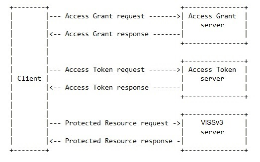

네 가지 핵심 액터 외에도 두 가지 추가 액터가 에코시스템에 참여한다:

- **리소스 소유자(Resource Owner)**: 일반적으로 차량 운전자이며, 접근 허가 전에 동의를 제공해야 할 수 있다.
- **에코시스템 매니저(Ecosystem Manager)**: 접근 제어 에코시스템을 관리하는 엔티티. 정책 문서를 제어하고 다른 액터들이 활용할 수 있는 PKI 에코시스템을 관리한다.

추상 프로토콜 플로우는 두 가지 다른 플로우를 통해 구현된다.

### 7.2 프로토콜 플로우 (비규범적)

두 가지 플로우가 설명되며, 플로우 선택은 클라이언트의 기능에 따라 달라진다.

클라이언트가 키 쌍 생성 및 디지털 서명과 같은 공개 키 암호화 작업을 지원하고 일반 실행 환경으로부터 개인 키를 보호하는 신뢰할 수 있는 실행 환경(TEE)에 접근할 수 있는 경우 장기 플로우를 사용할 수 있다. 이러한 기능이 없거나 사용하지 않도록 선택한 클라이언트는 단기 플로우를 선택해야 한다.

장기 플로우의 장점은 클라이언트가 더 긴 만료 시간의 Access Grant Token을 신뢰받을 수 있다는 것이다. 단기 플로우에서는 더 짧은 만료 시간으로 인해 클라이언트가 Access Grant Token 서버에 새 Access Grant Token을 얻기 위해 더 자주 연락해야 한다.

클라이언트는 Access Grant 요청에 공개 키를 제출하거나 제출하지 않음으로써 플로우 유형을 선택한다.

### 7.3 프로토콜 메시지 (비규범적)

#### 7.3.1 Access Grant 요청

요청에는 다음 Context 및 Proof 매개변수가 포함되어야 한다 (나머지는 선택적):

- **VIN**: 차량 식별 번호. 실제 VIN 대신 생성된 해시(pseudo-VIN)나 다른 고유 식별자를 사용할 수 있다.
- **Context**: 세 가지 핵심 역할로 구성된 클라이언트 컨텍스트 (사용자 역할, 애플리케이션 역할, 디바이스 역할).
- **Proof**: 클라이언트가 자신의 컨텍스트를 Access Grant Token 서버에 증명하는 데 사용하는 검증 메커니즘.
- **Public Key**: 이 매개변수가 있으면 클라이언트는 장기 Access Grant Token을 받는다.

클라이언트와 Access Grant Token 서버가 모두 차량 내에 배포된 경우 VIN 매개변수를 생략할 수 있다. 다른 모든 배포 시나리오에서는 VIN 매개변수가 포함되어야 한다.

#### 7.3.2 Access Grant 응답

응답에는 다음 매개변수가 포함되어야 한다:

- **Access Grant Token**: 클라이언트 요청 검증에 필요한 클레임을 포함하는 서명된 토큰.

#### 7.3.3 Access Token 요청

클라이언트는 유효한 Access Grant Token이 있어도 Access Token을 받기 전에 여러 요청을 보내야 할 수 있다. 동의가 필요한 경우 ATS가 ECF로 동의 요청을 전달하고 즉각적인 ECF 응답이 없을 수 있기 때문이다.

##### 초기 Access Token 요청

요청에는 다음 두 가지 매개변수가 포함되어야 한다:

- **Access Grant Token**: 클라이언트 요청 검증에 필요한 클레임을 포함하는 서명된 토큰.
- **Purpose**: 클라이언트가 요청한 데이터의 의도된 용도.

##### 조회 Access Token 요청

이 요청은 초기 Access Token 요청에 대한 응답으로 세션 핸들을 받은 후 클라이언트가 발행할 수 있다.

요청에는 다음 매개변수가 포함되어야 한다:
- **Session Handle**: 이전에 발행된 초기 Access Token 요청과 논리적으로 연결하는 참조 식별자.

#### 7.3.4 Access Token 응답

##### 동의 불필요 시 Access Token 응답

접근 제어에 데이터 소유자의 동의가 필요하지 않은 경우 즉각적인 응답이 가능하다. 성공 응답에는 Access Token이 포함된다.

##### 동의 필요 시 Access Token 응답

초기 Access Token 요청에 대한 응답에는 세션 핸들과 NOT_SET으로 설정된 동의 상태가 포함된다.

조회 Access Token 요청에 대해 세 가지 응답이 가능하다:
1. ECF로부터 아직 동의 응답 없음 — 초기 응답과 동일
2. ECF로부터 부정적 동의 응답 — 동의 상태 NO
3. ECF로부터 긍정적 동의 응답 — Access Token과 동의 상태 YES

#### 7.3.5 보호된 리소스 요청

토큰이 요청에 처음 제출될 때는 전체 포함 필수. 서버가 접근 토큰 캐싱을 지원하고 토큰 핸들을 반환하면 이후 요청에서 토큰 핸들을 사용할 수 있다.

### 7.4 액터

#### 클라이언트 (비규범적)

클라이언트는 세 가지 서브 액터의 추상적 표현이다:

- **디바이스**: VISSv3 서버에 요청하는 애플리케이션을 실행하는 역할.
- **애플리케이션**: 사용자를 대신하여 요청을 실행.
- **사용자**: 애플리케이션에 접근 권한을 위임.

#### Access Grant Token 서버 (비규범적)

Access Grant Token 서버는 클라이언트에게 Access Grant Token을 발행하는 역할을 한다. 사양은 단기 및 장기 두 가지 유형의 Access Grant Token을 지원한다.

#### Access Token 서버 (비규범적)

Access Grant Token 서버와의 성공적인 상호작용 후 클라이언트는 Access Token 서버에서 Access Token을 요청해야 한다. 클라이언트 요청에는 최소 두 가지 매개변수(Access Grant Token과 목적)가 포함되어야 한다.

Access Token 서버의 책임:
- Access Grant Token 검증
- 클라이언트 컨텍스트가 요청된 목적에 대해 인가되어 있는지 확인
- Access Token 생성 및 발행

#### Access Control 서버

VISSv3 서버는 Access Token 검증을 지원해야 한다. 검증에는 최소한 토큰 서명 및 토큰 만료 시간 확인이 포함된다.

성공적인 토큰 검증 후 서버는 토큰 범위가 요청과 호환되는지 확인해야 한다.

접근 권한 검증 결과는 아래 표와 같다:

| 권한 | read-only | read-write |
|------|-----------|------------|
| get  | Ok | Ok |
| set  | Nok | Ok |
| subscribe | Ok | Ok |

서버는 제한된 수의 Access Token 캐싱을 지원해야 한다. Access Token이 캐시되면 서버는 최소 24바이트 길이의 토큰 핸들을 반환해야 한다.

#### 리소스 소유자 (비규범적)

리소스 소유자는 일반적으로 차량의 소유자 및/또는 운전자다. 보호된 리소스에 접근하기 위해 동의가 필요한 경우 리소스 소유자에게 요청이 전달되어야 한다.

#### 에코시스템 매니저 (비규범적)

에코시스템 매니저는 접근 제어 시스템 관리를 담당하는 엔티티다. 일반적으로 Access Grant Token 서버 및 Access Token 서버 관리, 정책 문서 유지, 에코시스템의 다른 액터들이 사용할 PKI 도메인 보장이 포함된다.

### 7.5 자격 증명

#### 클라이언트 인증 (비규범적)

세 가지 클라이언트 서브 액터는 Access Grant Token 서버에 인증 자격 증명을 제공해야 한다. 이 자격 증명은 Access Grant Token 서버가 인정하는 인증 기관(CA)이 발행한 인증서일 수 있다.

#### Access Grant Token (비규범적)

##### 단기 Access Grant Token

단기 Access Grant Token은 헤더와 페이로드 모두에 다음 클레임을 포함해야 한다. VIN 클레임을 제외하고 모두 필수다.

```json
{
  "alg": "ES256",
  "typ": "JWT"
},
{
  "vin": "vehicle-id",
  "iat": 1609452095,
  "exp": 1609459199,
  "clx": "user+app+dev",
  "aud": "covesa.global/VISSv3",
  "jti": "5967e92e-40e8-5f39-892d-cc0da890db1d"
}
```

##### 장기 Access Grant Token

장기 Access Grant Token은 단기 토큰의 모든 클레임을 포함하며, 추가로 `pub` 클레임이 포함된다:

```json
{
  "alg": "ES256",
  "typ": "JWT"
},
{
  "vin": "vehicle-id",
  "iat": 1609452095,
  "exp": 1609459199,
  "clx": "user+app+dev",
  "pub": "client_pub_key",
  "aud": "covesa.global/VISSv3",
  "jti": "5967e92e-40e8-5f39-892d-cc0da890db1d"
}
```

`pub` 클레임은 RFC7517의 JWK 데이터 구조를 사용하여 클라이언트의 공개 키로 설정되어야 한다.

#### Access Token

Access Token은 헤더와 페이로드 모두에 다음 클레임을 포함해야 한다. VIN과 clx 클레임은 선택적이다.

```json
{
  "alg": "HS256",
  "typ": "JWT"
},
{
  "vin": "vehicle-id",
  "iat": 1609452095,
  "exp": 1609459199,
  "scp": "PurposeX",
  "clx": "user+app+dev",
  "aud": "covesa.global/VISSv3",
  "jti": "5967e93f-40f9-5f39-893e-cc0da890db2e"
}
```

`scp` (scope) 클레임은 목적 목록의 단축 이름 또는 토큰이 접근을 허용하는 신호 집합으로 설정되어야 한다. 범위 클레임이 목적으로 설정된 경우 클라이언트 컨텍스트 클레임이 토큰에 있어야 한다.

#### Proof of Possession (비규범적)

장기 Access Grant Token은 해당 토큰에 포함된 공개 키에 대응하는 개인 키의 Proof of Possession(PoP)을 동반해야 한다. 이 요구사항은 도청자가 Access Token 요청을 재사용하여 클라이언트를 가장하는 것을 방지한다.

### 7.6 클라이언트 컨텍스트 (비규범적)

클라이언트 컨텍스트는 세 가지 서브 액터로 특징지어지는 클라이언트 액터를 포함한다:

- 애플리케이션의 **사용자(user)**
- **애플리케이션(application)**
- **디바이스(device)**

#### 사용자 역할

VISSv3는 사용자의 최소 역할 집합을 다음과 같이 정의한다: OEM, Dealer, Independent, Owner, Driver, Passenger

#### 애플리케이션 역할

VISSv3는 애플리케이션의 최소 역할 집합을 다음과 같이 정의한다: OEM, Third Party

#### 디바이스 역할

VISSv3는 디바이스의 최소 역할 집합을 다음과 같이 정의한다: Vehicle, Nomadic, Cloud

### 7.7 정책 문서 (비규범적)

정책 문서는 일반적으로 에코시스템 매니저가 소유하고 생성한다. 이 문서는 무결성 보호를 위해 안전하게 처리되어야 하며, Access Token 서버에 안전하게 프로비저닝되어야 한다.

#### 목적 목록

클라이언트는 Access Token 요청 시 목적을 입력으로 제공해야 한다. 목적 목록은 JSON 형식으로 형식화되어야 한다:

```json
{"purposes":
    [{"short": "fuel-status",
    "long": "Fuel level and remaining range.",
    "contexts":[{"user":"Independent","app":["OEM", "Third party"], "device":"Cloud"}, ...],
    "signal_access":
        [{"path": "Vehicle.Powertrain.FuelSystem.Level", "access_permission": "read-only"},
        {"path": "Vehicle.Powertrain.FuelSystem.Range", "access_permission": "read-only"}]
    }]
}
```

#### 범위 목록

범위 목록은 클라이언트가 유효한 Access Token을 보유하고 있는지 여부와 관계없이 특정 클라이언트 컨텍스트에 대해 접근이 금지되는 트리 노드를 정의한다.

```json
{"scope":
    [{"contexts":[{"user":["Driver", "Passenger"], "app":"Third party", "device":"Vehicle"}, {}],
    "no_access":
        ["Vehicle.Drivetrain.Transmission.Speed",
        "Vehicle.CurrentLocation.Latitude",
        "Vehicle.CurrentLocation.Longitude"]
    }]
}
```

### 7.8 접근 제어 선택 (비규범적)

이 절은 접근 제어 모델의 보완 기능인 트리의 특정 부분에 선택적으로 접근 제어를 적용하는 기능을 설명한다. 이 기능은 다음의 경우 유용하다:

- 모든 노드가 접근 제어를 필요로 하지 않는다고 판단되는 경우
- 특정 노드에 전체 읽기-쓰기 검증 대신 쓰기 전용 검증만으로 충분한 경우

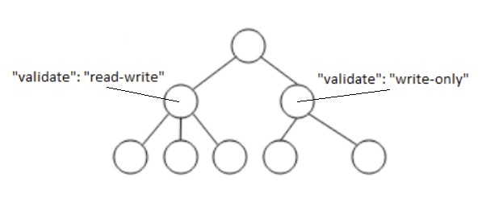

노드에 `"validate":"access-control-mode"` 키-값 쌍을 추가하여 접근 제어 적용 방식을 지정한다. 여기서 `access-control-mode`는 "write-only" 또는 "read-write" 문자열이다.

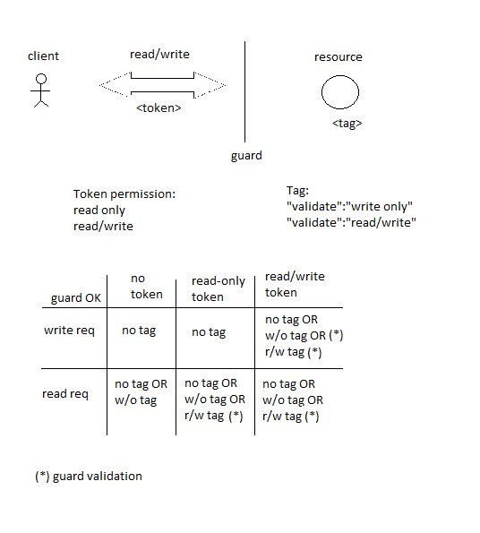

---

## 8. 동의 지원 (비규범적)

동의 처리는 차량 측 및 클라우드 측 아키텍처 서브시스템을 모두 포함하며, 이는 VISSv3의 범위를 벗어난다. 그러나 VISSv3 차량 서버는 동의 결정을 집행, 즉 요청된 데이터에 대한 접근을 허용하거나 차단할 수 있다.

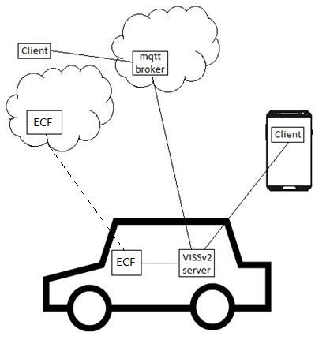

동의 상태는 다음 값 중 하나로 설정될 수 있다:

- **NOT_SET**: 서버는 ECF에 상태를 요청해야 한다. 즉각적인 ECF 응답이 없으면 서버는 이유를 나타내는 오류 코드와 함께 모든 클라이언트 요청을 거부해야 한다.
- **NO**: 서버는 이유를 나타내는 오류 코드와 함께 모든 클라이언트 요청을 거부해야 한다.
- **IN_VEHICLE**: 서버는 클라이언트 요청을 처리해야 한다. 클라이언트는 데이터를 오프보딩할 수 없다.
- **YES**: 서버는 클라이언트 요청을 처리해야 한다. 클라이언트는 데이터를 오프보딩할 수 있다.

동의 태그는 접근 제어 선택과 동일한 상속 규칙을 따르며 "+consent" 접미사로 표시된다:

```
"validate":"read-write+consent"
```

---

## A. JSON Schema (부록)

이 부록의 JSON 스키마에 따라 모든 전송 프로토콜을 통해 전송되는 기본 페이로드가 형식화되어야 한다.

```json
{
    "$schema": "https://json-schema.org/draft/2020-12/schema",
    "$id": "https://covesa.global/vissv3.1.bundled.schema.json",
    "title": "VISSv3",
    "description": "VISS version 3.1 bundled schema",
    "type": "object",
    "properties": {
        "action": {
            "type": "string"
        }
    },
    "required": ["action"],
    "oneOf": [
        {
            "properties": {"action": {"const": "get"}},
            "$ref": "/vissv3.1/get-message.schema.json"
        },
        {
            "properties": {"action": {"const": "set"}},
            "$ref": "/vissv3.1/set-message.schema.json"
        },
        {
            "properties": {"action": {"const": "subscribe"}},
            "$ref": "/vissv3.1/subscribe-message.schema.json"
        },
        {
            "properties": {"action": {"const": "unsubscribe"}},
            "$ref": "/vissv3.1/unsubscribe-message.schema.json"
        },
        {
            "properties": {"action": {"const": "subscription"}},
            "$ref": "/vissv3.1/subscription-event.schema.json"
        }
    ]
}
```

*(전체 JSON 스키마는 원문 HTML 파일 참조)*

---

## B. 서버 기능 (부록)

### B.1 서버 트리

서버 트리는 아래 나열된 구조를 포함해야 한다. 추가 부분은 선택적이다.

- 루트 노드 이름은 Server여야 한다.
- Server 노드는 최소 Support와 Config 두 자식을 가져야 한다.
- Support 노드는 최소 Protocol이라는 자식을 가져야 한다.
- Protocol 노드는 지원되는 전송 프로토콜을 정의하는 문자열 배열 데이터 유형의 속성이어야 한다.

서버 기능 트리 예시:

```yaml
Server:
  type: branch
  description: Root for the server capabilities.

Server.Support:
  type: branch
  description: Top branch declaring the server supported features.

Server.Support.Protocol:
  type: attribute
  datatype: string[]
  description: List of supported transport protocols.

Server.Support.Security:
  type: attribute
  datatype: string[]
  description: List of supported security related features.

Server.Support.Filter:
  type: attribute
  datatype: string[]
  description: List of supported filter features.

Server.Support.Encoding:
  type: attribute
  datatype: string[]
  description: List of supported payload encoding features.

Server.Support.Filetransfer:
  type: attribute
  datatype: string[]
  description: List of supported file transfer features.

Server.Support.DataCompression:
  type: attribute
  datatype: string[]
  description: List of supported data compression features.

Server.Config:
  type: branch
  description: Top branch declaring the configuration of server supported features.

Server.Config.Protocol.Http.Primary.PortNum:
  type: attribute
  datatype: uint32
  description: HTTP port number for the primary payload format.

Server.Config.Protocol.Websocket.Primary.PortNum:
  type: attribute
  datatype: uint32
  description: Websocket protocol port number for the primary payload format.

Server.Config.Protocol.Mqtt.PortNum:
  type: attribute
  datatype: uint32
  description: MQTT port number.

Server.Config.Protocol.Grpc.Protobuf.PortNum:
  type: attribute
  datatype: uint32
  description: gRPC port number for the protobuf encoded payload format.

Server.Config.Protocol.UDS.Socket:
  type: attribute
  datatype: string
  description: UDS socket file path.

Server.Config.AccessControl.AgtsUrl:
  type: attribute
  datatype: string
  description: Access Grant Token Server URL including port number and path.

Server.Config.AccessControl.AtsPortNum:
  type: attribute
  datatype: uint32
  description: Access Token Server port number.
```

### B.2 서버 기능 명명

| 프로토콜 | 설명 |
|---------|------|
| ws | Secure WebSocket |
| http | HTTPS |
| mqtt | MQTT |
| grpc | gRPC |
| uds | Unix Domain Sockets |

| 필터 | 설명 |
|------|------|
| timebased | 시간 기반 이벤트 트리거 조건 |
| change | 변경 기반 이벤트 트리거 조건 |
| paths | 복수 신호 경로 |
| range | 범위 기반 이벤트 트리거 조건 |
| curvelog | 곡선 로깅 기반 이벤트 트리거 조건 |
| history | 히스토리 데이터 접근 |
| metadata | 메타데이터 접근 |

| 파일 전송 | 설명 |
|----------|------|
| download | 차량으로 파일 다운로드 |
| upload | 클라이언트로 파일 업로드 |

| 데이터 압축 | 설명 |
|------------|------|
| pathuid | 정적 UID 경로 압축 |
| pathlocal | 요청 로컬 경로 압축 |
| timestamplocal | 응답 로컬 타임스탬프 압축 |

| 보안 | 설명 |
|------|------|
| accesscontrol | 접근 제어 |
| consent | 동의 |

| 접근 제어 플로우 | 설명 |
|----------------|------|
| short_term | 단기 접근 플로우 |
| long_term | 장기 접근 플로우 |
| signalset_claim | 신호 집합 클레임 |

### B.3 파일 전송 (비규범적)

파일 전송 사용 사례(클라이언트가 차량 서버로부터 파일을 보내거나 받는 경우)의 예로는 클라이언트가 지도를 차량으로 전송하거나(다운로드), 클라이언트가 차량으로부터 비디오 녹화 클립을 수신하는 경우(업로드)가 있다.

트리에서 파일 리소스를 표현하는 노드의 데이터 유형은 다음 고정 정의를 가진 구조체 데이터 유형에 대한 참조여야 한다:

```
typedef FileDescriptor struct {
    name string
    hash string
    uid string
}
```

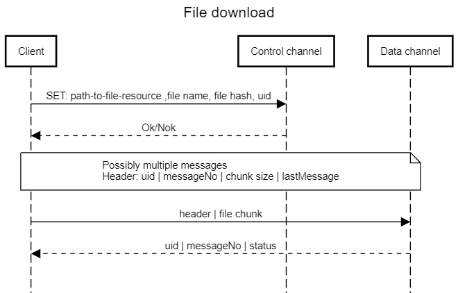

다운로드 사례의 클라이언트 SET 요청 예시:

```json
{
  "action": "set",
  "path": "Vehicle.Cabin.Infotainment.privateMap",
  "value": {
    "name": "privateMap.kml",
    "hash": "2aae6c35c94fcfb415dbe95f408b9ce91ee846ed",
    "uid": "2d878213"
  }
}
```

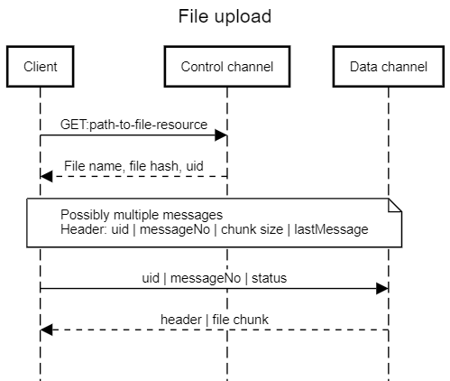

### B.4 데이터 압축 (비규범적)

기본 페이로드 형식은 텍스트 기반 JSON이므로 대용량 메시지가 발생할 수 있다. 특히 다수의 이벤트 메시지가 차량 외부로 전송되는 구독 시나리오에서는 전송 비용이 상당할 수 있다.

데이터 압축은 Read 또는 Subscribe 요청에 포함되는 선택적 매개변수를 통해 요청별로 적용된다:

```json
"dc": "A+B"
```

`A+B` 표현식은 서버에게 응답에서 경로 및/또는 타임스탬프에 적용할 압축 체계를 지시한다.

- A: 경로 압축 체계 (0=없음, 1=정적 UID 압축, 2=요청 로컬 압축)
- B: 타임스탬프 압축 체계 (0=없음, 1=요청 상대 압축)

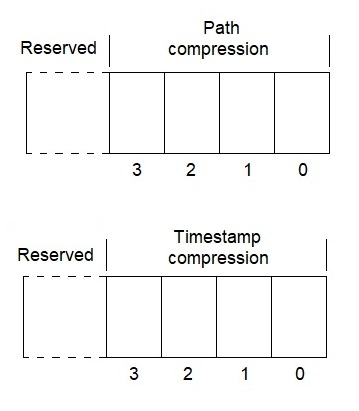

구독 요청 예시 (2가지 경로 및 타임스탬프 압축 포함):

```json
{"action":"subscribe","path":"Vehicle.CurrentLocation","filter":[{"variant":"paths","parameter":["Latitude", "Longitude"]}, {"variant":"timebased","parameter":{"period":"3000"}}], "dc":"2+1","requestId":"286"}
```

응답:
```json
{"action":"subscribe","requestId":"286","subscriptionId":"1","ts":"2025-01-10T11:46:09.955Z"}
```

첫 번째 이벤트 (경로 비압축):
```json
{"action":"subscription","data":[{"dp":{"ts":"-123","value":"56.02"},"path":"Vehicle.CurrentLocation.Latitude"},{"dp":{"ts":"-123","value":"12.36"},"path":"Vehicle.CurrentLocation.Longitude"}],"subscriptionId":"1","ts":"2025-01-10T11:46:12.957Z"}
```

두 번째 이벤트 (경로 압축된 인덱스로 대체):
```json
{"action":"subscription","data":[{"dp":{"ts":"-15","value":"56.03"},"path":"0"},{"dp":{"ts":"-15","value":"12.37"},"path":"1"}],"subscriptionId":"1","ts":"2025-01-10T11:46:15.956Z"}
```

---

## C. 순서 어긋난 요청 (부록)

Update 요청의 타임스탬프는 순서 어긋난 업데이트를 방지하기 위해 도입되었다. 즉, 서버가 가장 최근에 성공적으로 처리된 요청보다 이전에 발행된 요청을 처리하는 것을 방지한다.

아래 그림은 슬라이딩 윈도우가 있는 타임라인을 보여준다.

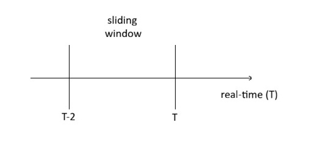

T는 현재 서버 실제 시간을 나타내며, T-2는 슬라이딩 윈도우가 최대 크기 2초로 구성된 경우의 후방 경계를 나타낸다. 따라서 허용되는 타임스탬프 범위는 T-2에서 T까지 걸쳐 있다.

서버가 현재 실제 시간 T보다 1초 앞선 타임스탬프 T-1이 설정된 성공적인 Update 요청을 받는다고 가정한다. T-1이 T-2와 T 사이에 있으므로 허용 타임스탬프 범위 내에 있다. 이 경우 유효한 허용 타임스탬프 범위는 T-1과 T 사이로 축소된다.

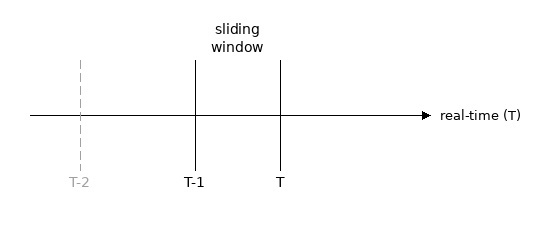

새로운 요청을 수신하면 현재 허용 슬라이딩 윈도우 내의 타임스탬프를 가져야 한다. 그렇지 않으면 오류 응답과 함께 거부되어야 한다.
